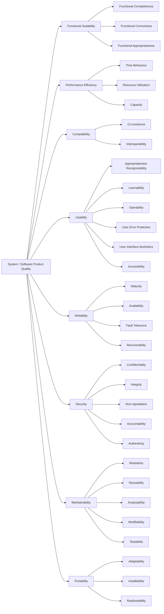

[](https://github.com/seahal/umaxica-app-jit/actions/workflows/integration.yml)


# Umaxica App (JIT)

## Routing

- `app`: end-user application
- `org`: staff and organization surface
- `com`: public and corporate surface

Multi-domain Rails application serving three independent audience surfaces. Routing is
host-constrained, so domain and subdomain matter in both development and production.

## Stack

- Ruby `4.0.x`
- PostgreSQL
  - Solid Queue
- Valkey/Redis (application cache and rate-limit counters, on separate services)
- Vite Rails + Stimulus + Turbo
- Tailwind CSS via Vite
- Propshaft
- Vite and `pnpm` for JavaScript build, linting, formatting, and tests

## Frontend and Assets

UI implementation should treat the Digital Agency of Japan Design System introduction as reading
before inventing screen patterns. Start at
[the introduction](https://design.digital.go.jp/dads/introduction/) and
`docs/reference/digital-agency-design-system.md`. This application's primitives remain in
`src/components/ui/` and `docs/design.md`.

- JavaScript entrypoints are bundled through Vite Rails from `src/entrypoints`.
- Stimulus controllers live in `src/controllers`.
- JavaScript tests live in `spec/` and run directly with Vitest.
- Browser CSS is imported once through the Vite stylesheet graph in `src/styles/application.css`.
- Static non-browser assets are served by Propshaft.

Useful commands:

```bash
bin/dev                         # Web, Vite, and jobs
bin/rails assets:precompile     # Production asset build
bin/rails vite:build            # Vite frontend build
bin/rails assets:clobber        # Remove compiled assets
```

## Local Setup

- Docker Compose, or rootless Podman with `podman-compose`
- Ruby `4.0.x`
- Bundler
- Node.js `24.19.0` (Active LTS)
- `pnpm@12.0.0`

### Credentials and secrets

`config/credentials/development.key`, `config/credentials/test.key`, and the repository-root `.env`
are not tracked in git. Obtain the two key files from the development lead; without them the
application cannot boot and `bin/rails test` cannot run. Credentials for AWS, Cloudflare, Fastly,
and other providers — staging, production, or an individual environment — are also requested from
the development lead and are never committed.

See `docs/operations/development-credential-provisioning.md` for the full procedure.

### The pnpm toolchain

The development image installs pnpm from the npm registry at the `PNPM_VERSION` build argument in
`Containerfile`, and that is the only pnpm the container provides: `/usr/local/bin/pnpm`. Do not
install pnpm separately inside the container — a second copy on `PATH` makes which pnpm ran depend
on shell state.

`package.json#packageManager` declares the version the project expects. This is pnpm's own pin, read
by pnpm and by the CI setup action; it is not a Corepack setting. `pnpm-workspace.yaml` sets
`pmOnFail: error`, so a pnpm whose version differs from that declaration fails and names the
mismatch rather than downloading a second pnpm behind your back. Changing the pinned version means
changing `package.json#packageManager` and `Containerfile`'s `ARG PNPM_VERSION` together, then
rebuilding the container.

Corepack is not used, not installed in the image, and no `corepack enable` step is required.

A fresh clone needs no local file. Start the standard stack, install dependencies, and boot
the app:

```bash
git clone https://github.com/seahal/umaxica-apps-jit-global.git
cd umaxica-apps-jit-global

# creating a local override is NOT required
docker compose config     # resolves as-is

docker compose up
bundle install
pnpm install
bin/setup
```

`compose.yaml` is the complete standard environment. `compose.override.yaml` is an
**optional**, gitignored, per-machine override that nothing creates for you — see
`compose.override.yaml.example` and
[Dev Containers CLI startup on rootless Podman](docs/operations/devcontainer-cli-podman-startup.md#the-compose-file-contract).
The preferred way in is `Dev Containers: Reopen in Container`.

`core` runs `sleep infinity` and is the workspace container; start the Rails processes with
`bin/dev` inside it. The PostgreSQL services use Compose
environment variables instead of inline fixed credentials:

```bash
POSTGRESQL_USER=root
POSTGRESQL_PASSWORD=development_password
POSTGRESQL_DATABASE=db
POSTGRESQL_REPLICATION_USER=replicator
POSTGRESQL_REPLICATION_PASSWORD=development_replication_password
```

The values above are local defaults only. Override them in your shell or local Compose environment
when you need different credentials.

WebAuthn trusted origins are derived from the public Auth host variables used by browser-facing
links:

```bash
PUBLIC_AUTH_SERVICE_URL=auth.umaxica.app
PUBLIC_AUTH_CORPORATE_URL=auth.umaxica.com
PUBLIC_AUTH_STAFF_URL=auth.umaxica.org
```

`TRUSTED_ORIGINS` remains available only for additional explicit origins.

`bin/setup` installs Ruby gems, runs `bin/rails db:prepare`, clears logs and temp files, then starts
`bin/dev`. It does not install JavaScript packages, so run `pnpm install` first.

If dependencies are already installed, you can start development directly:

```bash
bin/dev
```

`bin/dev` is the unified local entrypoint. It runs `bin/rails db:prepare` unless
`SKIP_DB_PREPARE=1`, then starts:

- `web`: Rails server on port `3000`
- `vite`: `bin/vite dev`
- `jobs`: `bin/jobs start`

## Development URLs

Modern browsers resolve `*.localhost` to `127.0.0.1`, so extra `/etc/hosts` entries are usually not
needed.

The development container publishes ports `3000` and `3036` to `127.0.0.1` only, so these URLs work
from the host and from nowhere else. Substituting the host's LAN or Tailscale address will not
connect, by design; PostgreSQL and Valkey are not published to the host at all. See
`docs/operations/development-host-port-exposure.md`.

Local hosts follow the `<service>.<surface>.localhost` order, and every surface is served by the
single Rails process on port `3000`.

| Surface                    | URL                                                                           |
| :------------------------- | :---------------------------------------------------------------------------- |
| Base                       | `http://base.{app,com,org}.localhost:3000`                                    |
| Base (developer / network) | `http://base.{dev,net}.localhost:3000`                                        |
| Auth                       | `http://auth.{app,com,org}.localhost:3000`                                    |
| Core                       | `http://core.{app,com,org,net,dev}.localhost:3000`                            |
| Side / Palm                | `http://side.{app,com,org}.localhost:3000` / `http://palm.app.localhost:3000` |
| Info / Help / Docs / News  | `http://{info,help,docs,news}.{app,com,org}.localhost:3000`                   |

Compose injects the `PUBLIC_*_URL` variables (`compose.yaml`), and each route's host constraint
lists the configured host alongside the `*.localhost` literal. **Development is published through
Cloudflare Tunnel behind Cloudflare Access**, and cloudflared leaves `Host` unmodified, so Rails
receives either family: the private `*.localhost` alias on a direct `frontend` network request, or
the published site name on a request the connector forwards. Development Host Authorization
therefore accepts the union of both and nothing else — `www.umaxica.com` and `auth.umaxica.app` are
served, while an Umaxica hostname that no `PUBLIC_*_URL` names is still rejected. Access, not Host
Authorization, is what keeps the development listener non-public. See
`docs/architecture/cloudflare-request-paths.md` for the trust boundaries and
`notes/implementation/2026-08-10-development-tunnel-access-verification.md` for the measured
end-to-end evidence.

`sign.{app,com,org}.localhost` resolves only when `AUTH_*_URL` and `PUBLIC_AUTH_*_URL` are unset.
Under Compose the canonical local names for the credential gateway are `auth.*`.

## コード品質

本プロジェクトのコード品質は、ISO/IEC 25010 の System / Software Product
Quality モデルに基づいて整理する。以降の `Linting and Formatting` / `Testing` /
`Security and Quality Checks` は、この品質特性をそれぞれ運用面で支えるための具体的手段に対応する。



## Linting and Formatting

```bash
bundle exec rubocop
bundle exec rubocop -a
bundle exec erb_lint .
bundle exec erb_lint -a .
pnpm check
pnpm fix
```

Use `rubocop -a`, `erb_lint -a .`, and `pnpm fix` to apply auto-fixes where available.

## Testing

### Rails Tests

```bash
bundle exec rails test
COVERAGE=true bundle exec rails test
```

Coverage reports are written to `coverage/`. `COVERAGE=true` forces a single test worker, so a
coverage run takes considerably longer than an ordinary parallel run.

### JavaScript Tests

Run JavaScript tests with Vitest:

```bash
pnpm test
pnpm test:watch                            # Watch mode
pnpm test:coverage
```

JavaScript tests are located in `spec/` and use Vitest. Coverage reports are written under
`coverage/vite/`.

## Security and Quality Checks

```bash
bundle exec brakeman --no-pager
bundle exec bundler-audit check --update
bundle exec database_consistency
pnpm audit
bin/debride
```

`bin/debride` is configured for Rails-aware analysis and can also be scoped to specific paths:

```bash
bin/debride app/services
DEBRIDE_MINIMUM=5 bin/debride
```

## Logging

Application logging is structured. Prefer event-style logging over ad hoc `Rails.logger` calls when
adding domain events or operational signals.

```ruby
Rails.event.notify("user.created", user_id: user.id)
Rails.event.tagged("auth") { Rails.event.notify("login.success", user_id: user.id) }
```

## Pre-commit Checks

Run the Lefthook pre-commit checks before committing:

```bash
lefthook run pre-commit
```

These checks cover formatting, linting, security audits, database consistency, and Rails tests.

## Troubleshooting

| Problem                                  | Fix                                                                          |
| :--------------------------------------- | :--------------------------------------------------------------------------- |
| Tailwind changes are not reflected       | Run `bin/rails assets:clobber` and restart `bin/dev`                         |
| Tests fail because databases are missing | Run `bin/rails db:prepare`                                                   |
| `bin/dev` stops during boot              | Check `PUBLIC_AUTH_*_URL` and database availability                          |
| Credentials cannot be decrypted          | Obtain the key; see `docs/operations/development-credential-provisioning.md` |

## Acknowledgement

- Secrets must stay in Rails credentials; do not commit plaintext secrets.
- WebAuthn origins are derived from `PUBLIC_AUTH_*_URL`; `TRUSTED_ORIGINS` is additive only.
- Public availability of this repository is not guaranteed permanently.
