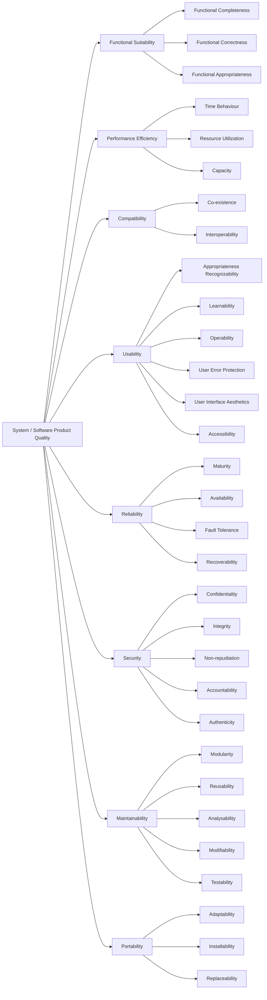

[](https://github.com/seahal/umaxica-app-jit/actions/workflows/integration.yml)


# Umaxica App (JIT)

## Routing

- `app`: end-user application
- `org`: staff and organization surface
- `com`: public and corporate surface
- `net`: network-facing surface supporting other TLDs (`app`/`com`/`org`), including
  cookie-authentication-less access
- `dev`: support and status surface

Multi-domain Rails application serving these audience surfaces. Routing is host-constrained, so
domain and subdomain matter in both development and production.

## Stack

### Backend

- Ruby on Rails (`8.2.x`, pre-release)
- Podman services for local infrastructure
- Storage: PostgreSQL (with Solid Queue), Valkey/Redis

### Frontend

- Two coexisting frontend approaches: Inertia Rails (React) and Rails' own default
  Vite Rails + Stimulus + Turbo stack
- Tailwind CSS via Vite, Propshaft for static assets
- Vite and Bun for JavaScript build, linting, formatting, and tests

### Infrastructure

- Dev: FakeCloud
- Test: N/A
- Prod: N/A
- CI: GitHub Actions
- CD: N/A

## Frontend and Assets

UI implementation should treat the Digital Agency of Japan Design System introduction as reading
before inventing screen patterns. Start at
[the introduction](https://design.digital.go.jp/dads/introduction/) and
`docs/reference/digital-agency-design-system.md`. This application's primitives remain in
`src/components/ui/` and `docs/design.md`.

- JavaScript entrypoints are bundled through Vite Rails from `src/entrypoints`.
- Stimulus controllers live in `src/controllers`.
- JavaScript tests live in `spec/` and run directly with Vitest.
- Browser CSS is imported once through the Vite stylesheet graph in `src/styles/application.css`.
- Static non-browser assets are served by Propshaft.

Useful commands:

```bash
bin/dev                         # Web, Vite, and jobs
bin/rails assets:precompile     # Production asset build
bin/rails vite:build            # Vite frontend build
bin/rails assets:clobber        # Remove compiled assets
```

## Local Setup

- Docker Compose, or rootless Podman with `podman-compose`
- Ruby `4.0.x`
- Bundler
- Node.js `24.19.0` (Active LTS)
- Bun `1.4.0`

### Credentials and secrets

`config/credentials/development.key`, `config/credentials/test.key`, and the repository-root `.env`
are not tracked in git. Obtain the two key files from the development lead; without them the
application cannot boot and `bin/rails test` cannot run. Credentials for AWS, Cloudflare, Fastly,
and other providers — staging, production, or an individual environment — are also requested from
the development lead and are never committed.

See `docs/operations/development-credential-provisioning.md` for the full procedure. For the
complete portable configuration contract, see `docs/operations/global-portability.md`.
`.env.example` contains only non-secret local defaults; `.env.devcontainer.example` contains the
Compose-DNS variant.

### The Bun toolchain

The development image provides the pinned Bun runtime declared by `package.json#packageManager`. Do
not install a second JavaScript package manager inside the container — a second copy on `PATH` makes
which tool ran depend on shell state.

`package.json#packageManager` declares the Bun version expected by the project and CI. Keep that pin
aligned with the Bun toolchain copied into the development and asset images. Corepack is not used,
and no `corepack enable` step is required.

A fresh clone needs no local file. Start the standard stack, install dependencies, and boot the app:

```bash
git clone https://github.com/seahal/umaxica-apps-jit-global.git
cd umaxica-apps-jit-global

# creating a local override is NOT required
docker compose config     # resolves as-is

docker compose up
bundle install
bun install --frozen-lockfile
bin/setup
```

`compose.yaml` owns shared infrastructure for both development modes. In Dev Container mode,
`.devcontainer/compose.yaml` adds `core`; in host-native mode, Rails runs directly on the VM and
`podman compose up -d` starts only PostgreSQL, Valkey, FakeCloud, and observability services.
`compose.override.yaml` is the only other root Compose file. It is **untracked and gitignored**
(since 2026-09-14), auto-discovered by a bare `podman compose`, and everything in it is
profile-gated: it carries the opt-in `remote-access` Tailscale/sshd overlay of `core` and is where
per-machine settings go. Being untracked is what keeps those settings per-machine; a fresh clone
does not have the file, and does not need it. See the Dev
Container startup documentation.

```bash
POSTGRESQL_USER=root
POSTGRESQL_PASSWORD=development_password
POSTGRESQL_DATABASE=db
POSTGRESQL_REPLICATION_USER=replicator
POSTGRESQL_REPLICATION_PASSWORD=development_replication_password
```

The values above are local defaults only. Override them in your shell or local Compose environment
when you need different credentials.

WebAuthn trusted origins are derived from the public Auth host variables used by browser-facing
links:

```bash
PUBLIC_AUTH_SERVICE_URL=auth.umaxica.app
PUBLIC_AUTH_CORPORATE_URL=auth.umaxica.com
PUBLIC_AUTH_STAFF_URL=auth.umaxica.org
```

`TRUSTED_ORIGINS` remains available only for additional explicit origins.

`bin/setup` installs Ruby gems, runs `bin/rails db:prepare`, clears logs and temp files, then starts
`bin/dev`. It does not install JavaScript packages, so run `bun install --frozen-lockfile` first.

If dependencies are already installed, you can start development directly:

```bash
bin/dev
```

`bin/dev` is the unified local entrypoint. It runs `bin/rails db:prepare` unless
`SKIP_DB_PREPARE=1`, then starts:

- `web`: Rails server on port `3000`
- `vite`: `bin/vite dev`
- `jobs`: `bin/jobs start`

## Development URLs

Modern browsers resolve `*.localhost` to `127.0.0.1`, so extra `/etc/hosts` entries are usually not
needed.

The development container publishes ports `3000` and `3036` to `127.0.0.1` only, so these URLs work
from the host and from nowhere else. Substituting the host's LAN or Tailscale address will not
connect, by design; PostgreSQL and Valkey are not published to the host at all. See
`docs/operations/development-host-port-exposure.md`. The Dev Container publishes Rails ports `3000`
and `3036` to `127.0.0.1` only. In host-native mode, PostgreSQL writer/reader and Valkey are also
published only to loopback (`5432`, `5433`, and `6379`) so host Rails can use them; containers
continue to use Compose DNS names. See `docs/operations/development-host-port-exposure.md`.

| Surface                    | URL                                                                           |
| :------------------------- | :---------------------------------------------------------------------------- |
| Base                       | `http://base.{app,com,org}.localhost:3000`                                    |
| Base (developer / network) | `http://base.{dev,net}.localhost:3000`                                        |
| Auth                       | `http://auth.{app,com,org}.localhost:3000`                                    |
| Core                       | `http://core.{app,com,org,net,dev}.localhost:3000`                            |
| Side / Palm                | `http://wide.{app,com,org}.localhost:3000` / `http://palm.app.localhost:3000` |
| Info / Help / Docs / News  | `http://{info,help,docs,news}.{app,com,org}.localhost:3000`                   |

The application contract supplies PUBLIC and PRIVATE URL values in both supported modes; Compose
supplies only service topology. Each route host constraint lists the configured host alongside its
localhost literal. Development is published through Cloudflare Tunnel behind Cloudflare Access;
Access, not Host Authorization, keeps the development listener non-public. See
`docs/architecture/cloudflare-request-paths.md` for the trust boundaries and
`notes/implementation/2026-08-10-development-tunnel-access-verification.md` for the measured
end-to-end evidence.

`sign.{app,com,org}.localhost` resolves only when `AUTH_*_URL` and `PUBLIC_AUTH_*_URL` are unset.
Under Compose the canonical local names for the credential gateway are `auth.*`.

## Code Quality

This project organizes code quality around the ISO/IEC 25010 System / Software Product Quality
model. The `Linting and Formatting` / `Testing` / `Security and Quality Checks` sections below each
correspond to concrete, operational means of supporting these quality characteristics.



## Linting and Formatting

```bash
bundle exec rubocop
bundle exec rubocop -a
bundle exec erb_lint .
bundle exec erb_lint -a .
bun run check
bun run fix
```

Use `rubocop -a`, `erb_lint -a .`, and `bun run fix` to apply auto-fixes where available.

## Testing

### Rails Tests

```bash
scripts/test-isolated bin/rails test
COVERAGE=true scripts/test-isolated bin/rails test test/
```

The isolated wrapper requires an explicit PostgreSQL test host and the test Valkey logical DBs
before Rails boots; it performs a read-only identity check and cleans only its run-scoped
auth-state keys. Coverage reports are written to `coverage/`. Set `PARALLEL_WORKERS=1` for a
focused run when diagnosing a failure.

### JavaScript Tests

Run JavaScript tests with Vitest:

```bash
bun run test
bun run test:watch                            # Watch mode
bun run test:coverage
```

JavaScript tests are located in `spec/` and use Vitest. Coverage reports are written under
`coverage/vite/`.

## Security and Quality Checks

```bash
bundle exec brakeman --no-pager
bundle exec bundler-audit check --update
bun audit
bundle exec debride
```

`debride` is configured for Rails-aware analysis and can also be scoped to specific paths:

```bash
bundle exec debride app/services
DEBRIDE_MINIMUM=5 bundle exec debride
```

## Logging

Application logging is structured. Prefer event-style logging over ad hoc `Rails.logger` calls when
adding domain events or operational signals.

```ruby
Rails.event.notify("user.created", user_id: user.id)
Rails.event.tagged("auth") { Rails.event.notify("login.success", user_id: user.id) }
```

## Pre-commit Checks

Run the Lefthook pre-commit checks before committing:

```bash
lefthook run pre-commit
```

These checks cover formatting, linting, security audits, database consistency, and Rails tests.

## Troubleshooting

| Problem                                  | Fix                                                                          |
| :--------------------------------------- | :--------------------------------------------------------------------------- |
| Tailwind changes are not reflected       | Run `bin/rails assets:clobber` and restart `bin/dev`                         |
| Tests fail because databases are missing | Run `bin/rails db:prepare`                                                   |
| `bin/dev` stops during boot              | Check `PUBLIC_AUTH_*_URL` and database availability                          |
| Credentials cannot be decrypted          | Obtain the key; see `docs/operations/development-credential-provisioning.md` |

## Repository Knowledge Base

- `adr/` — accepted architecture and design decisions, with the tradeoffs behind them.
- `docs/` — current, stable documentation of how the system works.
- `memos/` — exploratory field notes and rough analysis not yet stable enough for `docs/`, `plans/`, `adr/`, or `notes/`.
- `notes/` — non-authoritative implementation handoff and ADR-adjacent notes, candidates for later promotion.
- `plans/` — planning material not yet an implementation source of truth; GitHub issues remain the source of truth for accepted active work.
- `evidence/` — dated, flat records of completed tests, verifications, and audits.

## Acknowledgement

- Secrets must stay in Rails credentials; do not commit plaintext secrets.
- WebAuthn origins are derived from `PUBLIC_AUTH_*_URL`; `TRUSTED_ORIGINS` is additive only.
- Public availability of this repository is not guaranteed permanently.
