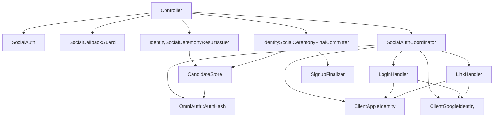

# Apple and Google External Authentication Architecture Audit

## Document Status

- Status: Phases 1–5 complete; Phase 6 lifecycle foundation and Phase 8 additive schema are
  implemented but await the remaining UX, controlled production cutover, and operational checks
- Audit date: 2026-07-24
- Repository: `seahal/umaxica-apps-jit-global`
- Surface: App end-user authentication only
- Protocols in scope: Sign in with Apple, Google OpenID Connect, OAuth 2.0 lifecycle operations
- Protocols out of scope: AWS IAM Identity Center implementation, SAML processing, staff SSO
- Apple Developer Program renewal date shown in the account: 2026-08-06
- Schedule timezone: Asia/Tokyo
- Renewal decision: Do not renew
- Internal deadline for work requiring Apple Developer Account access: 2026-08-05 23:59 Asia/Tokyo

This document records the read-only audit and the design decisions reached in the accompanying
interview. Production deployment must not start until these final decisions are incorporated,
implementation security gates pass, and controlled operational checks are complete. Secrets,
credential values, tokens, and complete external subjects must never be copied into this document.

Implementation update, 2026-07-24: the Apple real-strategy nonce gate detected missing-nonce
acceptance in `omniauth-apple` 1.4.0. The Infrastructure strategy extension now enforces nonce when
the Gem would skip it, and the signed-token contract passes. Google real-strategy characterization
confirms UserInfo/top-level UID as the current identity authority. See
`notes/implementation/2026-07-24-external-authentication-phase-1.md`.

Phase 2 update, 2026-07-24: the minimal principal, typed callback failure/result, provider
availability port and environment adapter, and fixed provider registry are implemented. Per-Use-Case
Result payloads are introduced with each Use Case so current Active Record models do not leak into
the new contract. See `notes/implementation/2026-07-24-external-authentication-phase-2-values.md`.

Phase 3 update, 2026-07-24: Apple and Google Provider Adapters, the Apple refresh-token candidate,
and the explicit Provider Adapter Factory are implemented but not yet connected to callback
orchestration. See
`notes/implementation/2026-07-24-external-authentication-phase-3-provider-adapters.md`.

Phase 6–8 update, 2026-07-24: encrypted Apple revocation requests, client-secret and revocation
ports, a verified minimal Apple notification inbox/processor, and the additive common identity and
Apple credential schema are implemented. The active repository remains the legacy adapter until a
controlled one-way production copy and verification completes; no automatic cutover occurs. See
`notes/implementation/2026-07-24-apple-lifecycle-foundation.md`.

## 1. Executive Summary

The current implementation has meaningful security controls: the App surface is separated from the
Org and Com surfaces, account linking requires a signed-in user and recent step-up, callback state
has database-backed replay protection, identity uniqueness is enforced in PostgreSQL, the candidate
`auth_hash` is encrypted, the last login method cannot be unlinked, and security events are written
to Chronicle rather than relying only on application logs.

The implementation is nevertheless not a stable external-authentication boundary. Protocol, browser,
application-flow, persistence, and lifecycle responsibilities are spread across controller concerns,
an OmniAuth initializer, service objects, models, session state, and ceremony stores.
`OmniAuth::AuthHash` and provider tokens flow through application services and are stored as a
serialized candidate. Apple and Google identities duplicate the same binding structure while also
storing tokens in plaintext columns. Provider lifecycle operations are absent.

The most important risks are:

1. Apple callback and nonce contracts are contradictory. Configuration requests a query-mode GET
   callback, while routes, guards, comments, and tests retain form-post/POST assumptions.
2. OAuth state and OIDC nonce ownership is duplicated. Apple Gem nonce verification is conditional
   on the nonstandard `nonce_supported` claim, while the application-generated Apple nonce is not
   supplied as the expected nonce to the assertion checker.
3. `SocialAuthVerifiedProviderAssertion` is named like a cryptographic verifier but only checks
   untrusted or partially trusted AuthHash fields. In particular, Google Gem 1.2.2 decodes
   `extra.id_info` without verifying its signature.
4. Full provider AuthHash objects, including token-bearing credentials and unnecessary claims, are
   stored in an encrypted ceremony candidate. Encryption reduces database disclosure risk but does
   not justify retaining an overbroad object graph.
5. Apple and Google user tokens are stored in plaintext database columns, Apple remote revocation is
   not performed, and Apple server notifications are not handled. Google RISC is also absent, but
   its implementation is explicitly deferred to P2.
6. Most integration tests use `OmniAuth.config.mock_auth`, bypassing strategy code, code exchange,
   JWT/JWKS behavior, and real request-phase CSRF behavior.

The approved target is a Ports and Adapters architecture:

```text
Rails Controller / Rack Boundary
             |
             v
External Authentication Callback Adapter
             |
             v
Login | Signup | Link | Unlink Use Cases
             |
             v
VerifiedPrincipal + Domain Ports + Typed Results
       ^             ^              ^
       |             |              |
OmniAuth Adapter  Identity Repo  Ceremony State Store
       |
       +-- Apple OIDC Adapter
       +-- Google OIDC Adapter

Separate lifecycle ports:
Apple Notification | Apple Revocation

P2 extension:
Google RISC / Cross-Account Protection
```

The Apple membership lapse creates operational urgency, not a documented guarantee of immediate
login failure. Apple explicitly states that an expired membership loses access to Certificates,
Identifiers & Profiles, but does not explicitly guarantee how an already configured web Services ID
and key will behave after expiration. The correct classification is therefore **no guarantee**.
Apple login remains enabled on a best-effort basis and fails closed when verification is
unavailable. Apple-only signup and normal account use are allowed. The product strongly recommends
adding a passkey, Google, or another non-Apple credential, and provides a persistent warning and
enrollment path without disabling the account.

The renewal boundary shown in the Apple Developer Account is 2026-08-06. The decision is not to
renew. Apple does not document the exact expiration time or guarantee when Certificates, Identifiers
& Profiles becomes unavailable on that date. All work requiring Developer Account access therefore
has an internal completion deadline of 2026-08-05 23:59 Asia/Tokyo.

## 2. Scope and Method

### 2.1 Evidence hierarchy

The audit uses:

1. Current user decisions.
2. Current repository code and tests.
3. Accepted repository ADRs and stable documentation.
4. Exact installed Gem source.
5. Apple, Google, Rails, OmniAuth, IETF, and OpenID Foundation primary sources.

Blog posts and Q&A sites are not evidence. Apple behavior not explicitly documented by Apple is
marked as unknown or inference rather than converted into a requirement.

### 2.2 Version baseline

The dependency baseline observed in `Gemfile.lock` is:

| Component                      | Version                                  |
| ------------------------------ | ---------------------------------------- |
| Rails                          | `8.2.0.alpha` from the Rails main branch |
| OmniAuth                       | `2.1.4`                                  |
| omniauth-apple                 | `1.4.0`                                  |
| omniauth-google-oauth2         | `1.2.2`                                  |
| omniauth-oauth2                | `1.9.0`                                  |
| omniauth-rails_csrf_protection | `2.0.1`                                  |
| oauth2                         | `2.0.25`                                 |
| jwt                            | `3.2.0`                                  |

These versions form one verification boundary. The target Gemfile must pin all of them exactly.
Updating any member requires an explicit compatibility change, upstream source review, real-strategy
contract tests, and provider E2E evidence.

### 2.3 Verification already performed

The read-only audit included:

- repository and dirty-worktree inspection;
- recursive source, configuration, route, migration, model, and test searches;
- exact installed Gem source inspection;
- focused social-authentication tests: 36 runs and 70 assertions, all passing at the time of audit;
- primary-source research recorded in Section 3.

Passing current tests does not prove the provider strategy contracts because the dominant tests use
OmniAuth mock mode.

## 3. Official Documentation Findings

All sources in this section were confirmed on 2026-07-24.

### 3.1 Apple

| Document and section                                                           | URL                                                                                                                              | Finding                                                                                                                                                                                                                       |
| ------------------------------------------------------------------------------ | -------------------------------------------------------------------------------------------------------------------------------- | ----------------------------------------------------------------------------------------------------------------------------------------------------------------------------------------------------------------------------- |
| Program Renewal, “Expired memberships”                                         | https://developer.apple.com/help/account/membership/renewal/                                                                     | An expired program membership loses access to Certificates, Identifiers & Profiles and app distribution functions. It does not promise continued Sign in with Apple web operation.                                            |
| About Sign in with Apple                                                       | https://developer.apple.com/help/account/capabilities/about-sign-in-with-apple/                                                  | Sign in with Apple begins with a primary App ID and may group related app and web identifiers.                                                                                                                                |
| Configure Sign in with Apple for the web, “Associate your website to your app” | https://developer.apple.com/help/account/capabilities/configure-sign-in-with-apple-for-the-web                                   | Web authentication requires a Services ID associated with a primary Sign in with Apple App ID and registered domains/return URLs.                                                                                             |
| Configuring your environment for Sign in with Apple                            | https://developer.apple.com/documentation/signinwithapple/configuring-your-environment-for-sign-in-with-apple                    | Return URLs are absolute and include scheme, host, and path; the Services ID is the web client identifier.                                                                                                                    |
| Incorporating Sign in with Apple into other platforms                          | https://developer.apple.com/documentation/signinwithapple/incorporating-sign-in-with-apple-into-other-platforms                  | Authorization starts at `/auth/authorize`; response processing depends on `response_mode`.                                                                                                                                    |
| Authenticating users with Sign in with Apple                                   | https://developer.apple.com/documentation/signinwithapple/authenticating-users-with-sign-in-with-apple                           | A client session is associated with an ID token using nonce.                                                                                                                                                                  |
| Sign in with Apple JS, `state`                                                 | https://developer.apple.com/documentation/signinwithapplejs/clientconfigi/state                                                  | The client creates state, sends it to Apple, and compares the returned value.                                                                                                                                                 |
| Configuring your webpage for Sign in with Apple                                | https://developer.apple.com/documentation/signinwithapple/configuring-your-webpage-for-sign-in-with-apple                        | Apple JS supports a configured nonce and registered client/redirect values.                                                                                                                                                   |
| Create a Sign in with Apple private key                                        | https://developer.apple.com/help/account/capabilities/create-a-sign-in-with-apple-private-key                                    | A primary App ID can have two associated keys. On suspected compromise, Apple says to create a new key, transition, then revoke the old key.                                                                                  |
| Token revocation                                                               | https://developer.apple.com/documentation/signinwithapplerestapi/revoke-tokens                                                   | `POST /auth/revoke` accepts a refresh or access token, client ID, and client-secret JWT. HTTP 200 also covers a previously invalidated token.                                                                                 |
| TokenResponse                                                                  | https://developer.apple.com/documentation/signinwithapplerestapi/tokenresponse                                                   | The token response contains ID, access, and refresh tokens. Apple directs server applications to store refresh tokens securely; access tokens are also used by revocation and user-migration operations.                      |
| TN3194, account deletion and token revocation                                  | https://developer.apple.com/documentation/technotes/tn3194-handling-account-deletions-and-revoking-tokens-for-sign-in-with-apple | Server integrations are expected to store required credentials securely and use the revocation endpoint for programmatic invalidation.                                                                                        |
| Processing changes for Sign in with Apple accounts                             | https://developer.apple.com/documentation/signinwithapple/processing-changes-for-sign-in-with-apple-accounts                     | Notifications are Apple-signed JWS values. The server validates the signature and handles allowlisted event types such as `consent-revoked`, account deletion, and private-relay state changes. TLS 1.2 or later is required. |
| Configure private email relay service                                          | https://developer.apple.com/help/account/capabilities/configure-private-email-relay-service                                      | Sending to Apple relay addresses requires registered outbound sources and SPF and/or DKIM authentication. The current empty Apple scope means this application does not consume relay addresses.                              |
| Transferring your apps and users to another team                               | https://developer.apple.com/documentation/signinwithapple/transferring-your-apps-and-users-to-another-team                       | An app transfer requires a transfer identifier for each Sign in with Apple user. This is a separate lifecycle operation, not part of normal login.                                                                            |
| Bringing new apps and users into your team                                     | https://developer.apple.com/documentation/signinwithapple/bringing-new-apps-and-users-into-your-team                             | A receiving team correlates transferred users with `transfer_sub`; the migration window is time-bounded.                                                                                                                      |

Apple does **not** explicitly guarantee that an existing Services ID, return URL, or private key
continues to work after program expiration. It explicitly documents loss of management access.
Therefore:

- continued login is unknown and not guaranteed;
- changing return URLs, key associations, primary App ID configuration, relay configuration, or
  notification configuration is expected to be unavailable because Certificates, Identifiers &
  Profiles is unavailable;
- whether a previously issued key remains accepted for any particular period is not documented;
- future rotation during the lapse cannot be relied upon;
- existing login continuation is an operational observation to test, not a contractual claim.

The application requests an empty Apple scope. It therefore does not depend on Apple-provided name,
email, Hide My Email, or private email relay for account identity. Relay configuration remains an
inventory item only.

### 3.2 Google

| Document and section                                              | URL                                                                                  | Finding                                                                                                                                                                                                 |
| ----------------------------------------------------------------- | ------------------------------------------------------------------------------------ | ------------------------------------------------------------------------------------------------------------------------------------------------------------------------------------------------------- |
| OpenID Connect, “Server flow” and token validation                | https://developers.google.com/identity/openid-connect/openid-connect                 | State protects request forgery; nonce protects replay when used; ID-token signature, issuer, audience, and expiration must be validated. `sub`, not email, is the stable account identifier.            |
| Google OIDC API Reference, authorization endpoint                 | https://developers.google.com/identity/openid-connect/reference                      | `state` is recommended. `nonce` is supported. Offline access is only for refreshing access when the user is absent. Google returns authorization responses to the registered redirect URI.              |
| OAuth 2.0 for Web Server Applications, token revocation           | https://developers.google.com/identity/protocols/oauth2/web-server#tokenrevoke       | The revocation endpoint accepts an access or refresh token and revokes the associated grant.                                                                                                            |
| OAuth 2.0 Policies                                                | https://developers.google.com/identity/protocols/oauth2/policies                     | Request only needed scopes, protect client credentials, handle refresh-token revocation and expiration, and use secure redirect origins.                                                                |
| Comply with OAuth 2.0 policies, brand verification                | https://developers.google.com/identity/verification/authentication-policy-compliance | Consent-screen identity, owned and verified domains, redirect origins, privacy policy, terms, and branding must accurately represent the application.                                                   |
| OAuth App Verification Help Center                                | https://support.google.com/cloud/answer/13463073                                     | Non-sensitive scopes do not require sensitive-scope verification, but displaying application branding can require the lighter-weight brand-verification process.                                        |
| Submitting your app for verification, OAuth consent screen        | https://support.google.com/cloud/answer/13461325                                     | The consent screen declares user type, support contact, branding, domains, and requested scopes; external apps begin in testing mode with test users.                                                   |
| OAuth best practices, secure token storage                        | https://developers.google.com/identity/protocols/oauth2/resources/best-practices     | Persisted user tokens must be stored securely, encrypted at rest, and deleted when no longer needed.                                                                                                    |
| Cross-Account Protection, OAuth token identifiers and event types | https://developers.google.com/identity/protocols/risc                                | RISC sends signed security event tokens. Individual token events identify refresh tokens by a 16-character prefix or a double SHA-512 hash. Session and account events require local protective action. |

The approved Google scopes are `openid profile`. Profile data is not persisted or used for account
resolution. The `profile` scope is retained because omniauth-google-oauth2 1.2.2 documents that it
requires either `profile` or `email`; email is intentionally not requested.

Google is an authentication, signup, and external-identity-link provider only. Every Google flow
uses `access_type=online`. The application does not request, acquire, or persist new Google refresh
tokens and does not use Google APIs after authentication. Google RISC / Cross-Account Protection is
deferred to P2 after the external-authentication architecture migration.

### 3.3 OmniAuth and provider Gems

| Document or source                             | URL                                                                                                    | Finding                                                                                                                                                                                                                                             |
| ---------------------------------------------- | ------------------------------------------------------------------------------------------------------ | --------------------------------------------------------------------------------------------------------------------------------------------------------------------------------------------------------------------------------------------------- |
| OmniAuth 2.1.4 README, request phase           | https://github.com/omniauth/omniauth/blob/v2.1.4/README.md                                             | OmniAuth 2 uses POST request phases by default to reduce request-phase CSRF risk.                                                                                                                                                                   |
| omniauth-rails_csrf_protection 2.0.1 README    | https://github.com/cookpad/omniauth-rails_csrf_protection/blob/v2.0.1/README.md                        | The Rails integration supplies authenticity-token protection for OmniAuth request phases.                                                                                                                                                           |
| omniauth-apple 1.4.0 README                    | https://github.com/nhosoya/omniauth-apple                                                              | Configuration includes Services ID, Team ID, Key ID, and private key.                                                                                                                                                                               |
| omniauth-apple 1.4.0 installed strategy source | `vendor/bundle/.../omniauth-apple-1.4.0/lib/omniauth/strategies/apple.rb`                              | The Gem defaults to `form_post`, creates `session["omniauth.nonce"]`, verifies Apple JWKS signature, `iss`, `aud`, `iat`, and `exp`, and verifies nonce only when the token contains `nonce_supported`. It generates a 60-second client-secret JWT. |
| omniauth-google-oauth2 1.2.2 README            | https://github.com/zquestz/omniauth-google-oauth2/blob/v1.2.2/README.md                                | The Gem supports scope, `prompt`, and `access_type`; its AuthHash contains tokens and raw provider information.                                                                                                                                     |
| omniauth-google-oauth2 1.2.2 strategy source   | https://github.com/zquestz/omniauth-google-oauth2/blob/v1.2.2/lib/omniauth/strategies/google_oauth2.rb | Top-level `uid` comes from the UserInfo endpoint `sub` using the bearer access token. `extra.id_info` is decoded without signature verification, after which selected claims are compared.                                                          |

The application may delegate login assertion verification to the pinned provider Gems, but the
delegation contract differs:

- Apple principal subject is accepted only after the Apple strategy has verified the signed ID
  token.
- Google principal subject is accepted from the successful UserInfo response.
- Google `extra.id_info`, either provider's `raw_info`, and application fallback extraction are not
  independent verification authorities.
- `SocialAuthVerifiedProviderAssertion` must be replaced with an adapter contract that describes
  which verified output is accepted instead of pretending to verify a JWT itself.

### 3.4 OAuth, OpenID Connect, and Rails

| Document and section                                                           | URL                                                                      | Finding                                                                                                                                                                                                              |
| ------------------------------------------------------------------------------ | ------------------------------------------------------------------------ | -------------------------------------------------------------------------------------------------------------------------------------------------------------------------------------------------------------------- |
| RFC 9700 Sections 2.1, 4.4, 4.7, 4.11, 4.13, 4.14                              | https://www.rfc-editor.org/rfc/rfc9700.html                              | Redirect URIs require exact matching; clients prevent CSRF, defend against mix-up, avoid open redirects, distrust forwarded proxy headers, and protect refresh tokens. PKCE is recommended for confidential clients. |
| OpenID Connect Core 1.0 Sections 2, 3.1.3.7, 15.5.2                            | https://openid.net/specs/openid-connect-core-1_0.html                    | The stable identity key is issuer plus subject. Authorization-code ID-token validation includes issuer, audience, authorized party where applicable, time, and nonce rules.                                          |
| Rails Active Record Encryption, deterministic and non-deterministic encryption | https://guides.rubyonrails.org/active_record_encryption.html             | Non-deterministic encryption is the secure default. Deterministic encryption is appropriate only where equality queries and uniqueness require it. Encrypted text has storage overhead.                              |
| Rails configuration, filtering sensitive parameters                            | https://guides.rubyonrails.org/configuring.html#config-filter-parameters | `config.filter_parameters` filters matching request parameters and Active Record inspection. Encrypted attributes are added to filter parameters by default.                                                         |
| Japanese Rails Guide, Active Record Encryption                                 | https://railsguides.jp/active_record_encryption.html                     | This is the user-selected explanatory reference for the Rails-standard encryption design.                                                                                                                            |

PKCE remains deferred for this migration. RFC 9700 recommends it for confidential clients, but the
currently pinned provider integrations and Apple authorization documentation do not establish a
tested shared PKCE contract. State, nonce, one-time code handling, exact redirect origin, and
real-strategy contract tests are mandatory. Reassessment is required when an Apple, Google, OmniAuth
OAuth, or other OAuth Gem changes; the Authorization Request Adapter is completed; a provider
documents PKCE support or a recommendation; a security review finds code-interception protection
insufficient; the callback route, proxy, or public origin changes; a mobile, native, or public
client is added; or the application adopts OAuth 2.1-equivalent requirements. Record every
reassessment in a Decision Record.

## 4. Current Architecture

### 4.1 Current callback flow

```mermaid
sequenceDiagram
  participant B as Browser
  participant C as Rails Controller/Concern
  participant O as OmniAuth Strategy
  participant P as Apple or Google
  participant S as Social Services
  participant D as App Principal DB

  B->>C: GET social session/registration entry
  C->>C: Store intent, provider, flow, state, Apple app nonce in cookie session
  C->>D: Issue callback state
  C->>O: GET or POST /social/:provider
  O->>O: Generate its state and Apple Gem nonce
  O->>P: Authorization request
  P->>O: Callback with code/state
  O->>P: Exchange code; fetch UserInfo/JWKS as strategy requires
  O->>C: env["omniauth.auth"]
  C->>C: Guard HTTP method, host, state, intent, session
  C->>S: Verify fields and coordinate login/link/signup
  S->>D: Store/update identity and tokens
  S->>D: Store encrypted full AuthHash for pending signup/link
  S-->>C: Hash-shaped result
  C-->>B: Redirect or render
```

### 4.2 Routes and HTTP contract

The Auth and Base route files both define:

- Google callback as GET;
- Apple callback as GET or POST;
- failure as GET;
- resourceful social session and registration entry pages.

The route comments say Apple form-post requires POST. The initializer, however, explicitly sets
Apple `response_mode: "query"` and `response_type: "code"`. The callback guard accepts Apple GET and
POST. `OmniAuth.config.allowed_request_methods` accepts both GET and POST for the request phase.

The approved contract is:

- request phase: POST only;
- Apple callback: GET only, query mode, code response;
- Google callback: GET only;
- fixed configured environment origin, never request Host or forwarded-host derivation;
- explicit local tunnel origin in development, with no fallback.

### 4.3 Session and callback state

`SocialAuth` stores:

- `social_auth_intent`;
- `social_auth_user_id`;
- `social_auth_started_at`;
- `social_auth_flow_id`;
- `social_auth_provider`;
- return/entry context;
- a ceremony transaction reference;
- `social_auth_nonce` for Apple;
- callback-state values owned by `SocialCallbackGuard`.

`SocialCallbackGuard` also captures OmniAuth's `omniauth.state`, persists a provider-bound state,
tracks start/used timestamps, and permits five minutes. The Apple strategy separately stores
`session["omniauth.nonce"]`.

This creates three conceptual values:

1. OmniAuth protocol state;
2. OmniAuth Apple protocol nonce;
3. application business ceremony binding.

Only those three concepts are retained in the target. Duplicate application OAuth state and Apple
nonce generation are removed. The business ceremony moves entirely to a database-backed one-shot
store with a ten-minute TTL and binds:

- provider;
- operation;
- browser/session reference;
- actor reference when present;
- configured callback origin;
- one-time transaction identifier.

The domain and Use Cases do not receive a Rails session object.

### 4.4 Services and concerns

Current responsibilities are distributed as follows:

| Current owner                                | Responsibilities currently mixed together                                                                                                    |
| -------------------------------------------- | -------------------------------------------------------------------------------------------------------------------------------------------- |
| `config/initializers/omniauth.rb`            | Provider registration, credentials, provider options, callback host derivation, middleware guards, request methods, failure mapping, logging |
| `SocialAuth` concern                         | HTTP/session context, state creation, Apple nonce creation, intent, link authorization, step-up, callback orchestration, redirects, errors   |
| `SocialCallbackGuard` concern/module         | Method checks, origin/host checks, state capture, persistent state, replay, session mutation, Rack request mutation, error responses         |
| `OmniauthCallbacksController`                | HTTP adapter, callback validation, ceremony issuance/commit, session issuance, login/signup/link branching, redirects and rendering          |
| `SocialAuthVerifiedProviderAssertion`        | Provider/UID/token presence, time checks, optional nonce and email claim checks using AuthHash fallbacks                                     |
| `SocialAuthCoordinator`                      | AuthHash parsing, provider selection, login/link dispatch, unlink transaction, audit writes, Hash results                                    |
| Login/link/signup services                   | Identity resolution, token persistence, status mutation, account creation, audit writes                                                      |
| Ceremony candidate/result/committer services | Grants, encrypted AuthHash storage, token-shaped results, subject digests, final persistence                                                 |

The current structure is not simply “too many service classes.” The problem is that protocol
verification, HTTP transport, application policy, persistence, and user-session effects do not have
one-way dependencies.

### 4.5 Persistence

`client_apple_identities` and `client_google_identities` each contain:

- `user_id`;
- `provider`;
- `uid`;
- `token`;
- `refresh_token`;
- token expiry;
- status and authentication timestamps;
- retention timestamps.

Both have unique `(uid, provider)` indexes and a unique user association. The token and subject
columns are filtered from Rails inspection but are not encrypted at rest.

`IdentitySocialCeremonyCandidate` encrypts and serializes the full `auth_hash`. This may include:

- access and refresh tokens;
- raw ID tokens;
- raw profile claims;
- names, email, images, and other PII;
- provider-library implementation details.

The target stores a minimal principal candidate and provider-specific credential candidate instead.

### 4.6 Dependency graph



## 5. Findings

### AG-AUTH-001 — Apple callback contract is contradictory

- Severity: High
- Confidence: High
- Affected files: `config/initializers/omniauth.rb`, `config/routes/auth.rb`,
  `config/routes/base.rb`, `app/controllers/concerns/social_callback_guard.rb`, callback tests
- Evidence: initializer selects code/query; routes and guard allow Apple GET and POST; route
  comments say form-post requires POST.
- Official requirement: Apple response handling follows the selected `response_mode`; registered
  return URLs must be exact. The Apple Gem default is form-post, but the application overrides it.
- Current behavior: two callback methods are accepted for one configured response mode.
- Risk: untested method-specific CSRF and SameSite behavior, stale comments, ambiguous production
  contract, and tests that can pass through a path the provider never uses.
- Recommendation: make query/code/GET the only Apple callback contract; remove POST route and
  allowance; add real-strategy and route tests.

### AG-AUTH-002 — OmniAuth request phase permits GET

- Severity: High
- Confidence: High
- Affected files: `config/initializers/omniauth.rb`, social entry controllers and tests
- Evidence: `OmniAuth.config.allowed_request_methods = %i(get post)`.
- Official requirement: OmniAuth 2 and its Rails CSRF integration use POST request phases for
  authenticity protection.
- Current behavior: custom GET entry pages can redirect into a GET OmniAuth request phase.
- Risk: login/link request CSRF protections depend on custom code instead of the standard Rails
  integration and are harder to prove under real middleware behavior.
- Recommendation: entry pages render or submit a Rails-CSRF-protected POST to OmniAuth; allow POST
  only.

### AG-AUTH-003 — Callback origin trusts the request host

- Severity: High
- Confidence: High
- Affected files: `config/initializers/omniauth.rb`, host/origin tests
- Evidence: `OmniAuthCallbackOrigin` builds the origin from `Rack::Request#host_with_port`.
- Official requirement: redirect URIs use exact registered values; RFC 9700 warns that reverse proxy
  headers are security-sensitive.
- Current behavior: the callback origin varies with accepted request host and scheme logic.
- Risk: host-header or proxy trust errors can alter the OAuth redirect URI or cause credential
  leakage/mix-up.
- Recommendation: load one canonical Auth-app origin per environment from validated boot
  configuration; allow an explicit development tunnel origin only.

### AG-AUTH-004 — State and nonce have multiple owners

- Severity: High
- Confidence: High
- Affected files: `SocialAuth`, `SocialCallbackGuard`, initializer, callback controller
- Evidence: the application creates and stores social callback state and Apple `social_auth_nonce`;
  OmniAuth creates `omniauth.state`; the Apple Gem creates `omniauth.nonce`.
- Official requirement: state and nonce are transaction-specific, single-use, and bound to the
  initiating user agent.
- Current behavior: the application and middleware both generate protocol-like values.
- Risk: one layer may validate a different value from the one sent to the provider, creating a false
  sense of replay protection.
- Recommendation: OmniAuth owns protocol state and nonce. A separate persistent application ceremony
  owns operation/actor/session binding and replay.

### AG-AUTH-005 — Apple nonce verification is not a stable explicit contract

- Severity: High
- Confidence: High
- Affected files: installed Apple strategy, `SocialAuth`, `SocialAuthVerifiedProviderAssertion`,
  callback controller
- Evidence: Apple Gem verifies nonce only when the ID token contains `nonce_supported`; the
  application assertion receives no expected Apple nonce while a separate application nonce is
  generated.
- Official requirement: Apple documents nonce as the client-session/ID-token association.
- Current behavior: Gem behavior depends on a claim not established as the application contract,
  while application verification is bypassed.
- Risk: nonce protection may be absent or misunderstood without a failing contract test.
- Recommendation: remove the duplicate app nonce; pin the Gem; add a real-strategy test proving
  nonce generation, return, single consumption, wrong nonce rejection, and missing nonce rejection
  whenever the authorization request sent a nonce. The test must use signed ID-token fixtures and
  the real strategy rather than mock AuthHash. A failure prevents production Apple ceremonies.
  Resolve failures first through supported Gem configuration or extension points, then by patching
  or replacing the strategy inside the Infrastructure Adapter, and only as a last resort by explicit
  verification at the Apple Adapter boundary. Never move nonce verification into a Controller or Use
  Case or generate independent protocol nonces in two layers.

### AG-AUTH-006 — `SocialAuthVerifiedProviderAssertion` overstates its authority

- Severity: High
- Confidence: High
- Affected files: `app/services/social_auth_verified_provider_assertion.rb`,
  `app/services/social_auth_uid_extractor.rb`
- Evidence: the service performs field comparisons only and reads `id_info` with `raw_info`
  fallback. It does not verify signatures, issuer keys, code exchange, or JWKS.
- Official requirement: OIDC authentication requires signature, issuer, audience, expiration, and
  applicable nonce/authorized-party validation.
- Current behavior: a class named “VerifiedProviderAssertion” accepts fields from an AuthHash after
  middleware processing and applies incomplete checks.
- Risk: future callers or Gem updates may treat unverified raw claims as authoritative.
- Recommendation: replace it with provider adapters that produce a typed principal only from the
  pinned strategy’s documented verified output. Do not independently reimplement JWT validation in
  the application.

### AG-AUTH-007 — Google `extra.id_info` is not signature-verified

- Severity: High
- Confidence: High
- Affected files: installed Google strategy, assertion service, result issuer
- Evidence: Google Gem 1.2.2 calls `JWT.decode(token, nil, false)` and checks selected claims.
  Top-level UID instead comes from the authenticated UserInfo response.
- Official requirement: Google ID-token use requires signature verification.
- Current behavior: application services can read `extra.id_info` and `raw_info` as claim fallbacks.
- Risk: unsafe claims can influence freshness, nonce, email, or future identity decisions.
- Recommendation: accept Google subject only from top-level UID derived from UserInfo; use canonical
  issuer and audience from the provider registry; discard `extra.id_info` and profile claims.
  Real-strategy contract tests must prove that failed code exchange or UserInfo retrieval cannot
  succeed, provider/ceremony mismatch is rejected, tampered fallback claims do not affect identity
  resolution, and callback tokens and profile data are not persisted. Failure blocks production
  Google ceremonies. A future move to ID-token-based identity requires a strategy that verifies
  signature, issuer, audience, authorized party, expiration, and nonce.

### AG-AUTH-008 — Full AuthHash persistence violates data minimization

- Severity: High
- Confidence: High
- Affected files: `IdentitySocialCeremonyCandidate`, `IdentitySocialCeremonyCandidateStore`, result
  issuer and final committer
- Evidence: the complete AuthHash is deep-stringified, encrypted, serialized, reconstructed, and
  later replayed.
- Official requirement: OAuth tokens and PII require secure, minimal storage; Rails encryption is
  not a reason to retain unnecessary data.
- Current behavior: encryption protects an overbroad payload containing tokens and provider
  implementation details.
- Risk: key compromise, console access, accidental logs, cookie/session pressure in adjacent code,
  and Gem schema coupling expose unnecessary credentials and PII.
- Recommendation: store `VerifiedPrincipalCandidate` plus a provider-specific encrypted credential
  candidate. Never persist AuthHash or raw assertions.

### AG-AUTH-009 — Identity and credential responsibilities share plaintext tables

- Severity: High
- Confidence: High
- Affected files: `ClientAppleIdentity`, `ClientGoogleIdentity`, database structure, social handlers
- Evidence: binding, status, access token, refresh token, and expiry share each provider identity
  table; token and subject columns are plaintext.
- Official requirement: stored provider tokens must be protected; OIDC identity is issuer plus
  subject.
- Current behavior: database or backup access reveals subjects and bearer credentials.
- Risk: account correlation, provider-token theft, and broad impact from SQL/backup disclosure.
- Recommendation: create a common identity-binding table with deterministic-encrypted subject and
  provider-specific credential tables with non-deterministic token encryption.

### AG-AUTH-010 — Google offline access is unnecessary

- Severity: Medium
- Confidence: High
- Affected files: initializer, entry/callback flow
- Evidence: `access_type: "offline"` and `prompt: "select_account"` are static for every ceremony.
- Official requirement: offline access is for access while the user is absent and should be
  requested only when needed.
- Current behavior: every Google flow requests offline access even though Google APIs are not used.
- Risk: unnecessary consent behavior, refresh-token issuance, and larger credential exposure.
- Recommendation: every login, signup, and link flow uses `access_type=online`; no new Google
  refresh token is acquired or stored.

### AG-AUTH-011 — Apple revocation and provider notifications are absent

- Severity: High
- Confidence: High
- Affected files: unlink coordinator, withdrawal lifecycle, routes, jobs
- Evidence: unlink deletes the local row; withdrawal replaces token values; no Apple revoke or Apple
  notification implementation exists. Google RISC is also absent.
- Official requirement: Apple provides a revocation endpoint and signed account-change
  notifications. Google RISC provides security events but is deferred by product decision.
- Current behavior: external grants may remain active after local unlink or withdrawal, and
  provider-side revocation is not reflected locally.
- Risk: stale grants, account takeover persistence, privacy noncompliance, and session continuation
  after provider compromise.
- Recommendation: implement Apple revocation and notification ports with durable idempotent jobs and
  session revocation in the current migration. Record Google RISC / Cross-Account Protection as P2
  and do not couple it to the initial adapter/use-case migration.

### AG-AUTH-012 — Unlink is locally safe but not lifecycle-complete

- Severity: Medium
- Confidence: High
- Affected files: `SocialAuthCoordinator`, credential inventory, unlink tests
- Evidence: the user row is locked, the last method is rejected, and the identity is destroyed in
  one local transaction.
- Official requirement: external authorization should also be revoked where supported.
- Current behavior: local lockout protection is good, but no remote side effect or retry state
  exists.
- Risk: remote credentials outlive the local binding.
- Recommendation: preserve the last-credential check in `UnlinkExternalIdentity`, disable locally
  first, then run durable revocation. Delete identity and credential after successful revocation.

### AG-AUTH-013 — Mock-mode tests do not execute provider security code

- Severity: High
- Confidence: High
- Affected files: social integration and callback tests
- Evidence: tests assign `OmniAuth.config.mock_auth` AuthHash values directly.
- Official requirement: none; this is a verification-gap finding.
- Current behavior: strategy JWT/JWKS/code-exchange, nonce, real state, request-phase CSRF, and
  provider HTTP behavior are bypassed.
- Risk: tests can remain green while production authentication is broken or insecure.
- Recommendation: retain fast mock tests for Use Cases but add exact-version strategy, Rack,
  integration, sandbox E2E, notification, and revocation tests.

### AG-AUTH-014 — Logging filters are present but not a complete logging contract

- Severity: Medium
- Confidence: High
- Affected files: filter initializer, `JitLogEvent`, social services and controller logs
- Evidence: Rails filters `uid`, tokens, credentials, and related keys; `JitLogEvent` uses a
  separate redactor; some social debug messages manually interpolate identifiers or exceptions.
- Official requirement: Rails parameter filtering applies to matching parameter/attribute keys, not
  arbitrary strings assembled by application code.
- Current behavior: structured sensitive keys are generally filtered, but duplicated key lists and
  free-form strings can bypass the common filter.
- Risk: subject fragments, provider response content, or tokens embedded in exceptions can leak.
- Recommendation: make `config.filter_parameters` the sensitive-key authority, apply
  `ActiveSupport::ParameterFilter` inside structured event formatting, retain URL query stripping,
  and prohibit sensitive string interpolation.

### AG-AUTH-015 — Callback and use-case results are untyped Hashes

- Severity: Medium
- Confidence: High
- Affected files: coordinator, login/link handlers, callback controller, ceremony issuer/committer
- Evidence: services return Hashes containing user, identity, JWT payload, pending flags, provider,
  and status-like fields.
- Official requirement: none; this is an internal-contract finding.
- Current behavior: valid and invalid field combinations are possible and controller branches know
  service internals.
- Risk: flow drift, missing cases, and provider-specific leakage.
- Recommendation: use validated `Data` result types with named constructors.

### AG-AUTH-016 — Callback replay controls are distributed

- Severity: Medium
- Confidence: High
- Affected files: callback guard, callback state store, ceremony candidate/result/committer
- Evidence: state-used flags exist in both session and database-oriented structures; multiple
  tokens/digests guard later phases.
- Official requirement: state, nonce, authorization code, and business completion are single-use.
- Current behavior: controls exist but ownership and idempotency boundaries are difficult to prove.
- Risk: stale tab and concurrent callback behavior may differ by path.
- Recommendation: one protocol state owner in OmniAuth and one transactional business ceremony
  record with unique consumption constraints.

### AG-AUTH-017 — Provider availability cannot be explicitly controlled

- Severity: Medium
- Confidence: High
- Affected files: initializer, entry UI/controllers
- Evidence: providers are always registered from optional credentials; no App provider ceremony
  switch exists.
- Official requirement: none; operational control finding.
- Current behavior: a known compromise or long outage requires a broad deployment change or site
  shutdown.
- Risk: unsafe ceremonies remain reachable or unrelated authentication is unnecessarily stopped.
- Recommendation: require strict boolean environment settings for Apple and Google ceremony
  availability behind an exchangeable availability port. Notification and revocation consumers
  remain active when ceremonies are disabled. Existing unexpired ceremonies may complete under the
  initial disabled behavior; the typed contract must also support a future incident stop that
  rejects callbacks.

## 6. Responsibility Matrix

| Responsibility                       | Current owner                   | Recommended owner                                   | Reason                                                                               |
| ------------------------------------ | ------------------------------- | --------------------------------------------------- | ------------------------------------------------------------------------------------ |
| HTTP parameter and response handling | Controller plus concerns        | Thin Rails controllers                              | HTTP-only boundary                                                                   |
| OmniAuth request-phase CSRF          | Mixed custom guard and OmniAuth | OmniAuth Rails CSRF adapter                         | Standard POST request-phase contract                                                 |
| OAuth state                          | App concern, guard, OmniAuth    | OmniAuth strategy                                   | One protocol owner                                                                   |
| OIDC nonce                           | App concern and Apple strategy  | Provider strategy contract                          | One protocol owner, version tested                                                   |
| Business intent and replay           | Session plus stores             | `CallbackCeremonyStorePort`                         | Persistent, one-shot, provider-bound                                                 |
| Callback host/origin                 | Request-derived initializer     | Validated provider registry                         | Exact deployment configuration                                                       |
| Provider option selection            | Static initializer              | `ProviderRegistry` and authorization-request policy | Operation-specific Google options                                                    |
| Provider ceremony availability       | Absent                          | `ProviderAvailabilityPort` and environment adapter  | Independent typed start/callback decisions without ENV leakage                       |
| Code exchange/JWKS/JWT               | Provider Gems                   | Pinned OmniAuth adapters                            | Avoid duplicate cryptography                                                         |
| AuthHash mapping                     | Many services                   | Provider callback adapters                          | Prevent boundary leakage                                                             |
| Verified identity contract           | Hash/UID                        | `VerifiedPrincipal`                                 | Minimal typed input                                                                  |
| Identity lookup/write                | Provider models/services        | `ExternalIdentityRepositoryPort`                    | Shared stable binding                                                                |
| Provider token storage               | Identity models                 | Provider credential repositories                    | Protocol-specific schemas and retention                                              |
| Login                                | Coordinator/handler/controller  | `LoginWithExternalIdentity`                         | One application use case                                                             |
| Signup                               | Callback/candidate/finalizer    | `SignupWithExternalIdentity`                        | Confirmation and activation policy                                                   |
| Link                                 | Concern/coordinator/handler     | `LinkExternalIdentity`                              | Actor, step-up, conflict policy                                                      |
| Unlink                               | Concern/coordinator             | `UnlinkExternalIdentity`                            | Last credential plus revocation process                                              |
| Session issue/revoke                 | Controller and auth concerns    | `SessionIssuerPort` / `SessionRevokerPort`          | Base lifecycle boundary                                                              |
| Audit record                         | Multiple services               | `AuthenticationAuditPort`                           | Chronicle remains authoritative                                                      |
| Redirect/render mapping              | Controller/concern              | Controller result mapper                            | HTTP/UI concern                                                                      |
| Apple client-secret JWT              | Apple Gem                       | `AppleClientSecretProviderPort` adapter             | Apple-only capability                                                                |
| Apple revoke                         | Absent                          | `AppleCredentialRevocationPort`                     | Apple-only lifecycle                                                                 |
| Apple notification verify            | Absent                          | `AppleNotificationVerifierPort`                     | Apple JWS contract                                                                   |
| Google revoke                        | Absent                          | Defer                                               | No Google token is retained for ongoing API access. Reassess with P2 lifecycle work. |
| Google RISC verify                   | Absent                          | P2 `GoogleSecurityEventVerifierPort`                | Google SET work follows the architecture migration.                                  |
| Logging redaction                    | Rails filter plus custom regex  | Rails filter-backed structured logger               | One key authority                                                                    |

### 6.1 Concern method disposition

| Current method category                     | Disposition                                                   |
| ------------------------------------------- | ------------------------------------------------------------- |
| Read callback/request parameters            | Controller                                                    |
| Render, redirect, HTTP status               | Controller                                                    |
| Shared controller error-to-response mapping | Thin Controller Concern                                       |
| Read/write Rails session transport          | Thin Controller Concern, limited to opaque ceremony reference |
| Generate/validate OAuth state               | Remove from application concern; OmniAuth adapter             |
| Generate/validate OIDC nonce                | Remove from application concern; provider adapter             |
| Validate provider claims                    | Provider adapter contract                                     |
| Bind provider/operation/actor/session       | Callback ceremony store                                       |
| Resolve identity                            | Identity repository                                           |
| Login/signup/link/unlink                    | Separate Use Cases                                            |
| Last credential policy                      | Policy/inventory used by Unlink Use Case                      |
| Database transactions                       | Use Case and repository boundary                              |
| Session issuance/revocation                 | Session ports                                                 |
| Audit event creation                        | Audit port                                                    |
| Provider case statements                    | Provider registry or adapter factory                          |
| Serialized AuthHash candidate               | Delete                                                        |
| Rack method/origin gate                     | Narrow Rack/controller adapter, driven by fixed registry      |

## 7. Pattern Decision Record

| Pattern                        | Decision                                            | Scope and rationale                                                                                                                            |
| ------------------------------ | --------------------------------------------------- | ---------------------------------------------------------------------------------------------------------------------------------------------- |
| Hexagonal Architecture         | Adopt                                               | Defines dependency direction around the external-authentication application boundary.                                                          |
| Ports and Adapters             | Adopt                                               | Provider, persistence, ceremony, session, notification, and revocation are replaceable adapters.                                               |
| Clean Architecture             | Reject as a separate framework                      | Its dependency rule is already satisfied by the selected hexagonal boundary; adopting both labels adds no implementation guidance.             |
| Anti-Corruption Layer          | Adopt                                               | OmniAuth AuthHash and provider claims are translated once into internal values.                                                                |
| Adapter                        | Adopt                                               | Apple, Google, OmniAuth, Active Record, state store, session, and audit implementations.                                                       |
| Strategy                       | Adopt narrowly                                      | Provider-specific authorization-request and credential policies selected by registry.                                                          |
| Registry                       | Adopt                                               | Fixed allowlist of provider IDs, issuer, audience, adapter, and route. Runtime availability is delegated to its port; no runtime class lookup. |
| Factory                        | Adopt narrowly                                      | Builds adapters from registry entries; no business decisions.                                                                                  |
| Policy Object                  | Adopt                                               | Last credential, Apple signup redundancy, and operation-specific credential requirements.                                                      |
| Application Service / Use Case | Adopt                                               | Separate Login, Signup, Link, and Unlink commands.                                                                                             |
| Command                        | Defer                                               | Use Cases already model commands; command objects add value only if a durable queue boundary appears.                                          |
| Orchestrator                   | Adopt narrowly                                      | Callback application service coordinates adapter, ceremony, Use Case, session, and audit.                                                      |
| Transaction Script             | Reject as target                                    | Current flow is already a large transaction script; explicit ports/results are needed.                                                         |
| Saga                           | Reject                                              | No distributed compensation graph is required. Revocation is a small durable process manager.                                                  |
| State Machine                  | Adopt only for persisted ceremony/revocation status | Do not create a global authentication state machine.                                                                                           |
| Value Object / Typed DTO       | Adopt                                               | `VerifiedPrincipal`, provider ID, issuer, audience, subject, and failure.                                                                      |
| Result Object                  | Adopt                                               | Two result layers prevent callback and business status mixing.                                                                                 |
| Domain Event                   | Adopt narrowly                                      | Verified external security events and revocation completion/failure.                                                                           |
| Repository Port                | Adopt                                               | External identity, credentials, ceremony, and security-event inbox.                                                                            |
| Callback State Store Port      | Adopt                                               | Business ceremony only; not duplicate OAuth state.                                                                                             |
| Credential Store Port          | Adopt provider-specific interfaces                  | Apple and Google schemas differ.                                                                                                               |
| Session Issuer Port            | Adopt                                               | Keeps Rails/Base session implementation outside Use Cases.                                                                                     |
| Notification Verifier Port     | Adopt provider-specific interfaces                  | Apple JWS and Google SET must not be forced into one claim shape.                                                                              |
| Revocation Port                | Adopt provider-specific interfaces                  | Token types and provider responses differ.                                                                                                     |
| ActiveSupport::Concern         | Retain only for Rails glue                          | No provider verification or business transactions.                                                                                             |
| Form Object / ActiveModel      | Defer                                               | No new user-input form contract is required by this migration.                                                                                 |
| ActiveJob                      | Adopt                                               | Durable revocation retry and verified-notification processing.                                                                                 |
| Middleware / Rack adapter      | Adopt narrowly                                      | OmniAuth entry and fixed callback transport protections.                                                                                       |
| Initializer                    | Retain for wiring only                              | No dynamic host decisions or business policy.                                                                                                  |

## 8. Proposed Target Architecture

### 8.1 Dependency direction

```text
Auth App Controller / OmniAuth Rack Adapter
                    |
                    v
      ExternalAuthentication::Callback
                    |
                    v
 Login | Signup | Link | Unlink Application Use Cases
                    |
                    v
 Values + Policies + Ports (no Rails, OmniAuth, or Active Record)
                    ^
                    |
  +-----------------+-----------------+------------------+
  |                                   |                  |
Apple/Google adapters       Active Record repos    Ceremony/session/audit adapters
```

Use Cases must not know `OmniAuth::AuthHash`, Rails session, controller classes, Active Record
models, JWT libraries, or provider HTTP clients. Provider adapters must not write identities.
Controllers must not branch on provider behavior beyond selecting a registry entry.

### 8.2 Internal values

```ruby
ExternalAuthentication::VerifiedPrincipal.new(
  provider:,
  subject:,
  issuer:,
  audience:,
  verified_at:,
  verification_authority:
)
```

Rules:

- `provider` is a fixed registry identifier.
- `subject` is the strategy-approved subject, never email.
- `issuer` and `audience` are canonical registry values after adapter verification, not copied from
  untrusted raw claims.
- `verified_at` is local processing time.
- `verification_authority` identifies the adapter and exact pinned version.
- Tokens, names, email, picture, raw claims, `auth_time`, and unused claim fields are absent.
- Raw assertions, raw ID tokens, SHA-256 digests, and HMAC digests are neither persisted nor logged.
  Replay and idempotency rely on OAuth state, OIDC nonce, authorization-code consumption, atomic
  database-backed ceremony consumption, and a unique ceremony public ID.

No assertion fingerprint is introduced initially. A future concrete correlation requirement requires
a separate Decision Record and an `AssertionFingerprintPort`.

The callback layer returns:

```ruby
ExternalAuthentication::CallbackResult
# verified(principal:, credential_candidate:)
# failed(failure:)

ExternalAuthentication::Failure
# code, provider, retryable, safe_reason
```

Each Use Case has its own validated Result:

- login: `success`, `signup_required`, `step_up_required`, `account_disabled`, `failed`;
- signup: `success`, `confirmation_required`, `alternative_credential_recommended`, `conflict`,
  `failed`;
- link: `success`, `conflict`, `step_up_required`, `failed`;
- unlink: `success`, `already_unlinked`, `last_credential`, `revocation_pending`, `failed`.

Provider cancellation, invalid callback, replay, provider unavailability, and configuration error
are callback failure codes rather than impossible business-result combinations.

### 8.3 Provider registry

The registry is a fixed application configuration containing:

- provider ID;
- protocol;
- canonical issuer;
- configured audience/client ID reference;
- request and callback paths;
- callback origin;
- adapter class;
- operation-specific authorization policy.

The registry does not contain an environment value or decide runtime availability. Controllers,
Concerns, Use Cases, and provider adapters do not read availability environment variables. Callers
use:

```ruby
module ExternalAuthentication
  module ProviderAvailabilityPort
    def start_decision(provider:, operation:, context:)
      raise NotImplementedError
    end

    def callback_decision(provider:, ceremony:, context:)
      raise NotImplementedError
    end
  end
end
```

`ExternalAuthentication::AvailabilityDecision` is a typed decision with `enabled`, `disabled`,
`draining`, and `incident_stop` states. The initial environment adapter maps literal `true` to
`enabled` and literal `false` to `disabled`.

The planned implementations are:

- `EnvironmentProviderAvailabilityAdapter` initially;
- `AwsAppConfigProviderAvailabilityAdapter` when operational control moves to AWS AppConfig;
- `CompositeProviderAvailabilityAdapter` only under an explicitly approved multi-source precedence
  rule.

Required environment settings:

- `APPLE_SOCIAL_CEREMONY_ENABLED`
- `GOOGLE_SOCIAL_CEREMONY_ENABLED`

Only the literal values `true` and `false` are valid. Required settings use one-argument
`ENV.fetch`; absence or malformed values fail boot. These settings do not disable notification
ingress, credential revocation, unlink/withdrawal follow-up, audit processing, existing deletion
jobs, or security-event processing.

Initially, `disabled` prevents new login, signup, and link ceremonies and hides their start buttons.
A ceremony issued before the switch may complete before its existing expiry. `callback_decision`
exists from the first release so a future `incident_stop` can reject callbacks during key
compromise, broken assertion verification, mix-up suspicion, or another security incident. The
environment adapter initially implements new-ceremony stopping only. The port may later be backed by
AWS AppConfig without changing callers. The AWS adapter normalizes AppConfig configuration version,
state, reason code, and incident ID into the typed decision.

Only an operator authorized to change and deploy production environment settings may activate the
initial switch. Activation triggers include suspected provider-secret disclosure, assertion
signature failure, nonce/state/issuer/audience contract-test failure, suspected mix-up, anomalous or
unknown callbacks, a material provider incident, provider/production configuration mismatch,
inability to validate a legitimate callback, or unintended credential logging or persistence. After
migration to AWS AppConfig, AWS CloudTrail is the primary evidence of who changed the configuration;
Rails never infers the actor. Chronicle stores provider, availability state, configuration version,
source, reason code, incident ID, and observed time and correlates it to CloudTrail through the
incident ID. It never stores secrets, tokens, subjects, email, or raw callbacks. Recovery requires
cause removal, passing contract tests, production configuration verification, and a controlled E2E.

### 8.4 Authorization request policy

| Provider/operation      | Scope            | Access type      | Prompt           |
| ----------------------- | ---------------- | ---------------- | ---------------- |
| Apple login/signup/link | empty            | provider-defined | provider-defined |
| Google login            | `openid profile` | `online`         | `select_account` |
| Google signup/link      | `openid profile` | `online`         | `select_account` |

Signup and link may commit only when the required revocation credential is present:

- Apple: valid token response containing a refresh token that can support the approved lifecycle;
- Google: no durable provider credential is required or persisted.

Google access and ID tokens are callback-transient data. The provider adapter consumes them only as
required by the pinned strategy and discards them before calling an application Use Case.

### 8.5 Data model and encryption

#### Common identity binding

`client_external_identities`:

- `user_id`;
- `provider`;
- `issuer`;
- `subject` as Rails deterministic-encrypted text/string with sufficient ciphertext capacity;
- status and authentication timestamps;
- retention timestamps only while a revocation process is pending.

Constraints:

- unique `(issuer, subject)`;
- unique `(user_id, provider)`;
- provider allowlist;
- active binding requires a user;
- one Apple and one Google binding maximum per user.

`uid` is renamed to `subject`. The OmniAuth adapter maps AuthHash `uid` at the boundary.

#### Apple credential

`client_apple_identity_credentials`:

- external identity foreign key;
- non-deterministic encrypted `refresh_token` text;
- last-validation and retention timestamps;
- validation/revocation state and retry metadata.

The Apple ID token is verified and used for subject extraction only inside the Provider Adapter,
then discarded. Only canonical issuer, verified subject, verification authority, verification
timestamp, and the minimum authentication audit outcome may cross the boundary. Raw JWT headers,
payloads, claim sets, and assertion digests are not persisted.

The Apple access token is memory-only and discarded after immediate callback processing. Before
release, contract tests and the current Apple API contract must prove that refresh-token-based
revocation is sufficient. Persisting an access token requires a separate Decision Record proving it
indispensable. The Apple refresh token is the only provider token approved for encrypted storage and
is used solely for credential validation, revocation, and unlink/withdrawal grant cleanup.

#### Google credential

No Google token credential record is created in the current target. Google access and ID tokens
remain callback-transient, and no new refresh token is acquired or persisted. Phase 8 removes legacy
Google token columns after the adapter/use-case cutover. A provider-specific Google credential
schema may be introduced only by the deferred P2 RISC/lifecycle design if that design establishes a
justified durable credential requirement.

#### Ceremony candidates

Replace encrypted serialized `auth_hash` with:

- minimal encrypted principal candidate;
- provider-specific encrypted credential candidate;
- opaque public reference;
- provider, operation, actor/session binding, expiry, consumed timestamp;
- unique ceremony public ID.

Candidates are fetched by opaque reference, so candidate subject uses non-deterministic encryption.

#### Fields not encrypted

Provider, canonical issuer, configured audience identifier, status, timestamps, retry count, failure
code, foreign keys, public random references, and notification JTI remain plaintext operational
metadata. Raw assertions and notification JWS/SET values are verified and discarded.

#### Rails encryption key policy

Use the existing Rails Active Record Encryption configuration and credentials. There is no scheduled
rotation or always-on multi-key registry. For compromise:

1. disable ceremonies and enter maintenance mode;
2. install a new current key;
3. temporarily make the old key available for reads;
4. re-encrypt every affected row;
5. verify ciphertext-only storage and full decryptability;
6. remove the old key;
7. reopen the service.

Before the renewal boundary, create a second Sign in with Apple private key and retain both the
current and second keys in approved secret storage. Record each Key ID and its primary App ID
association outside this document. Generate a client-secret JWT with the second key and prove it by
an authorization-code exchange or controlled Sign in with Apple E2E. Do not revoke the current key
before the boundary.

The application still has one configured active Apple key at a time. Automatic rotation, always-on
dual-key selection, and periodic key changes are not implemented. The second key is a verified
standby credential. A runbook records temporary cutover for its validation and future manual
compromise response.

### 8.6 Revocation process

Unlink and withdrawal follow:

```text
authorize + step-up
  -> lock actor
  -> reject if final AAL1 credential
  -> disable local identity
  -> revoke all relevant app sessions
  -> persist revocation request
  -> enqueue provider revoke
  -> provider success/already invalid
       -> delete provider credential
       -> delete identity binding
       -> record non-PII audit completion
  -> transient provider failure
       -> retry with bounded backoff
       -> retain encrypted credential for at most 7 days
       -> after deadline, crypto-shred and record unresolved provider outage
```

The user-facing unlink/withdrawal operation is not blocked by provider downtime. It returns a local
success/pending result after local disablement. The process is an idempotent durable process
manager, not a general Saga.

Delete the encrypted refresh token after successful or already-invalid revocation, completed
consent-revoked or account-deleted processing, replacement by a credential that makes the old token
unnecessary, or the seven-day failure-retention deadline. The client-secret JWT is generated from
the `.p8` only when needed and is never stored in the database, logs, session, ceremony candidate,
or audit record.

### 8.7 Apple server notifications

External contract:

- `POST https://auth.umaxica.app/apple/notifications`
- resourceful route: `namespace :apple; resources :notifications, only: :create`
- TLS 1.2 or later;
- strict request body size;
- no browser session;
- no raw payload logging or persistence.

The endpoint verifies signature, algorithm allowlist, issuer, audience, times, JTI, and supported
event shape synchronously. It then writes an idempotent inbox event and enqueues processing.
Unsupported or invalid payloads do not mutate identity state.

Effects:

- `consent-revoked` disables the Apple identity and credential, revokes every App-surface session,
  preserves the Umaxica account and every other credential, and may be reversed only by a wholly new
  Apple ceremony that returns the same verified issuer and subject as explicit renewed consent;
- `account-deleted` makes the old Apple identity terminally disabled, revokes every App-surface
  session, and never automatically re-enables that binding; the Umaxica account and every other
  credential remain;
- neither email nor a notification automatically links, recovers, re-enables, or replaces an
  identity;
- a new Apple Account, provider email, asserted subject, or notification never automatically links
  to an existing Umaxica account;
- private-relay events are acknowledged and recorded without user-profile mutation because the
  application requests no email scope;
- transfer events are not implemented until a real Apple team-transfer requirement exists.

Do not claim that an Apple-only user can recover through ordinary identity verification unless a
high-assurance recovery process actually exists. Such manual recovery is a separate phase and is not
implemented until its identity proofing, approver, credential-enrollment procedure, and audit record
are approved. Before production notification enforcement, Apple-only users receive the approved
passkey/Google warning and direct enrollment paths.

Inbox events are unique by provider event ID or JTI. Duplicates are no-ops, older events cannot roll
back a newer state, account deletion cannot regress to the weaker consent-revoked state, and an
account-enabled-like event never automatically re-enables an identity. Processing retries with
exponential backoff at most ten times and for at most 24 hours, then enters a dead-letter state and
alerts operations. Persist only the verified minimal event, JTI, event type, received time, and
processing state; never persist raw JWS.

### 8.8 Deferred Google Cross-Account Protection

Google RISC / Cross-Account Protection is P2 and is not implemented as part of the current
external-authentication architecture migration. The initial design does not add a Google
notification endpoint, SET verifier, RISC stream administration, token-identifier indexes, or
RISC-driven account/session effects.

P2 must start from the migrated ports and identity binding rather than extending legacy social
concerns. It must independently decide endpoint configuration, signed SET verification, idempotency,
session effects, account enabled/disabled behavior, operational credentials, and whether any durable
Google credential is justified.

### 8.9 Failure and user experience

- Apple remains visible during the membership lapse unless the explicit ceremony switch is off.
- Cancellation, invalid callback, replay, provider outage, and misconfiguration are distinct
  internal failure codes.
- User-visible text is generic and rendered inline on the originating screen.
- When a provider is unavailable, render the localized equivalent of “This login method is currently
  unavailable. Use another login method or try again later.” Show only alternatives that are
  actually available. Do not disclose a compromise, verification failure, or other internal stop
  reason.
- Do not use Rails flash.
- Provide retry and alternative-authentication actions.
- Never automatically switch providers or auto-link by email.
- An Apple identity disabled by `consent-revoked` may be reactivated only through a wholly new Apple
  ceremony returning the same verified issuer and subject. A terminally disabled `account-deleted`
  binding is never reactivated. Other replacement or linking requires sign-in through an alternative
  credential and an explicit, step-up-protected link; email and asserted subjects never auto-link.
- Apple-only signup and normal account use are allowed.
- After Apple signup, strongly recommend adding a passkey, Google, or another non-Apple
  authentication method. The signup completion page shows skippable direct links to add a passkey or
  link Google. The security settings page shows a persistent non-dismissible card while no
  alternative AAL1 credential exists. A dismissible post-login warning reappears after 30 days while
  the user remains Apple-only.
- Remove all Apple-only warnings and the persistent card when another valid AAL1 credential is
  added. Warning copy explains the access-continuity benefit without portraying Apple as unsafe.
- Do not disable, restrict, or withhold normal account activation while the user remains Apple-only.
- Requiring a non-Apple credential for important operations is a separate future decision and is
  outside this implementation.

### 8.10 SAML extensibility

Future SAML support may reuse:

- `VerifiedPrincipal`;
- identity-binding repository;
- Login/Signup/Link/Unlink Use Cases;
- typed Results;
- session and audit ports.

It must not reuse:

- OIDC nonce or claim validators;
- OAuth state or authorization request interfaces;
- token or refresh-token repositories;
- Apple/Google revocation interfaces;
- OIDC notification verifiers.

The SAML adapter owns entity ID, NameID format, assertion signature, audience, recipient,
InResponseTo, clock, and metadata concerns. This satisfies extensibility without creating a false
universal federated-auth protocol.

## 9. Security Contract and Threat Review

| Threat                              | Target control                                                                         |
| ----------------------------------- | -------------------------------------------------------------------------------------- |
| OAuth/login CSRF                    | POST-only OmniAuth request phase, Rails authenticity token, OmniAuth state             |
| Account-linking CSRF                | Authenticated actor, recent step-up, provider-bound business ceremony                  |
| Callback replay                     | OmniAuth state/nonce plus one-shot persistent ceremony                                 |
| Authorization-code replay           | Provider token endpoint and single callback consumption                                |
| Provider mix-up / issuer confusion  | Fixed provider registry, canonical issuer, audience, distinct provider binding         |
| Audience/authorized-party confusion | Pinned adapter contract and real strategy tests                                        |
| Open redirect                       | Allowlisted internal return target values; no arbitrary callback query target          |
| Callback host injection             | Fixed configured Auth origin; no request/forwarded-host construction                   |
| Proxy header confusion              | Trusted proxy configuration audited separately; callback ignores forwarded host        |
| SameSite callback failure           | GET callbacks remain compatible with Lax cookie behavior                               |
| Intent tampering                    | Persistent ceremony binds operation, provider, actor, and session                      |
| Account-link takeover               | Explicit link only; no email linking; uniqueness and row locks                         |
| Concurrent signup/link              | Database unique indexes and transactional conflict mapping                             |
| Duplicate callback / stale tab      | Atomic ceremony consume; typed replay/expired failures                                 |
| Session fixation                    | Issue/rotate session only after successful Use Case; revoke on provider security event |
| Provider outage                     | Fail callback closed, preserve safe existing state for transient validation outage     |
| Key compromise                      | Explicit ceremony kill switch, maintenance-mode manual replacement                     |
| Secret/token leakage                | Rails encryption, Rails filter-backed structured logging, no raw persistence           |
| Cookie overflow                     | Opaque ceremony reference only; no AuthHash/JWT in cookie session                      |
| Unlink lockout                      | Credential inventory rejects final AAL1 removal                                        |
| Apple shutdown lockout              | Apple-only warning, direct alternative-enrollment path, explicit provider availability |
| Notification spoofing               | Synchronous provider signature and claims verification before durable inbox            |
| Notification replay                 | Unique provider/JTI event record                                                       |
| Notification DoS                    | Body cap, rate limit, timeouts, fast acknowledgment after durable write                |

Application logs are diagnostic only. Chronicle is authoritative for authentication-security,
unlink, withdrawal, revocation, and provider-event outcomes.

## 10. Test Audit and Target Pyramid

### 10.1 Current strengths

Current tests cover portions of:

- normal login, signup confirmation, link, and unlink;
- missing AuthHash/UID and provider mismatch;
- state missing/mismatch/expiry/replay and provider binding;
- callback host/method cases;
- duplicate and concurrent identity writes;
- stale tab/session conditions;
- step-up and last-credential unlink rejection;
- cancellation and provider failure mapping;
- unique identity constraints;
- Apple and Google callback paths in mock mode.

### 10.2 Current gaps

The suite does not adequately execute:

- invalid provider signature;
- wrong issuer/audience/authorized party through the real Gem;
- expired/future/malformed ID tokens through real strategy code;
- nonce missing/wrong/reused through the Apple strategy;
- unknown JWKS key and key rotation;
- real authorization-code exchange;
- real OmniAuth request-phase CSRF;
- Apple query versus form-post at strategy level;
- Apple first-login `user` payload and later-login absence;
- Apple refresh-token revocation, refresh validation, client-secret expiry, notifications, and key
  change;
- Google online-only operation policy and proof that no refresh token is retained;
- consent/project/redirect configuration failures;
- production/sandbox browser behavior.

### 10.3 Required test pyramid

1. Value and policy unit tests:
   - typed principal/result invariants;
   - registry allowlist and strict ENV parsing;
   - last credential and Apple alternative-enrollment recommendation policies;
   - encryption declarations and filters.
   - typed availability states, strict booleans, independent provider switches, and safe messages.
2. Provider adapter contract tests using exact installed Gem strategy classes:
   - real middleware request and callback phases;
   - stubbed provider HTTPS/JWKS/token/UserInfo responses;
   - signed JWT fixtures generated by test keys;
   - Apple request nonce generation/transmission, correct nonce success, wrong/missing nonce
     rejection, and replay;
   - Google code exchange, UserInfo authority, provider binding, tampered fallback claims, and
     absence of token/profile persistence;
   - failure classification.
3. Rack tests:
   - POST-only request phase and CSRF;
   - GET-only callbacks;
   - fixed full host;
   - SameSite/session behavior;
   - notification body limits and invalid signatures.
4. Rails integration tests:
   - every Login/Signup/Link/Unlink result;
   - replay, expiry, stale tabs, concurrency, session rotation/revocation;
   - inline failure rendering and no flash.
   - disabled start behavior, unexpired callback draining, alternative links, and lifecycle
     consumers continuing during ceremony stops.
5. Job/process tests:
   - idempotent Apple provider revoke;
   - retry/backoff;
   - Apple seven-day crypto-shred deadline;
   - duplicate and out-of-order provider events.
   - notification exponential retry, ten-attempt/24-hour bounds, dead-letter, and alert creation.
6. Provider sandbox/manual E2E:
   - Apple production-domain query callback;
   - subsequent Apple login;
   - Google login, signup/link consent, account chooser;
   - Apple unlink and provider-side grant removal;
   - notification endpoint verification where provider tooling permits.

Mock AuthHash tests remain useful only below the provider adapter boundary. Every such test must be
described as a Use Case test, not proof of OIDC validation.

## 11. Migration Plan

### Phase 0 — Apple administration and current-configuration inventory

- Changes: finalize this audit; inventory current Apple and Google non-secret configuration; prepare
  the Apple ceremony kill switch.
- Tests: controlled production-domain Apple E2E with the current key and a temporary second-key
  cutover.
- Migration: none.
- Credentials: verify the current `.p8` backup; create and securely store the second `.p8`; record
  both Key IDs and primary App ID associations; generate a client-secret JWT with the second key.
- Provider console: record Team ID, primary App ID, Services ID, domains, return URLs, current and
  second Key IDs, and server-to-server notification URL.
- Rollback: restore the currently configured key after the second-key test; do not revoke either
  key.
- Acceptance: the second key completes an authorization-code exchange or controlled E2E; every
  portal-only item is complete, unverified, or inaccessible; no secret appears in the audit.
- Deadline priority: **deadline critical — complete by 2026-08-05 23:59 Asia/Tokyo**.

### Phase 1 — Characterization and real-Gem contract tests

- Changes: add provider adapter harness tests without changing production flow.
- Tests: exact pinned Apple/Google/OmniAuth stack, signed fixtures, Rack CSRF/method/host behavior.
  Apple tests prove request nonce generation/transmission, correct nonce success, wrong/missing
  nonce rejection, and callback/nonce replay through the real strategy. Google tests prove code
  exchange and UserInfo failure handling, provider/ceremony binding, top-level UID authority,
  tampered fallback isolation, and absence of token/profile persistence.
- Migration: none.
- Credentials/provider console: none.
- Rollback: remove tests only if they prove an invalid assumption and replace with corrected tests.
- Acceptance: both provider security contracts pass. A provider whose contract fails remains
  disabled in production; mock AuthHash is not evidence for this gate.
- Deadline priority: required before Phase 2; complete before the production callback cutover in
  Phase 5.

### Phase 2 — Values, typed Results, and provider registry

- Changes: add `VerifiedPrincipal`, callback failure/result, per-Use-Case Results, fixed registry,
  `ProviderAvailabilityPort`, typed availability decisions, and strict environment adapter.
- Tests: constructors, invalid states, provider allowlist, strict ENV parsing, independent provider
  stops, start versus callback decisions, and continuation of lifecycle consumers.
- Migration: none.
- Credentials: no values move.
- Rollback: adapters may dual-return old Hash temporarily inside one release branch, not to domain
  callers.
- Acceptance: no new Use Case accepts AuthHash.
- Acceptance: `VerifiedPrincipal` contains only provider, subject, issuer, audience, verified time,
  and verification authority; no assertion fingerprint is introduced.
- Deadline priority: required before Phase 3. The Apple ceremony kill switch must be deployable by
  2026-08-05 23:59 Asia/Tokyo.

### Phase 3 — Apple and Google provider adapters

- Changes: isolate AuthHash translation and provider-specific verification authority; remove raw
  claim fallbacks; wrap `ClientAppleIdentity` and `ClientGoogleIdentity` behind Repository Adapters
  without integrating their tables.
- Tests: exact-version provider contracts, verified subject extraction, wrong provider/issuer/
  audience/nonce behavior, credential minimization, and no AuthHash leakage.
- Migration: no common-table migration. Existing identity tables remain the persistence boundary.
- Credentials: no secret changes.
- Provider console: none.
- Rollback: switch callback wiring back to the characterized path while preserving repository
  adapter compatibility.
- Acceptance: application-layer code receives only `VerifiedPrincipal` and typed provider credential
  data.
- Deadline priority: required before Phase 4 and the Phase 5 production callback cutover.

### Phase 4 — Login, Signup, Link, and Unlink Use Cases

- Changes: extract four Use Cases and ports; use repository adapters over the existing provider
  tables; shrink controllers/concerns to Rails glue; make the ten-minute business ceremony
  persistent and one-shot.
- Tests: every typed status, authorization, step-up, conflict, concurrency, session behavior.
- Migration: no common identity migration; expire legacy AuthHash candidates rather than translating
  them.
- Credentials/provider console: none.
- Rollback: route adapters can point back to the characterized coordinator during development only;
  do not introduce long-term dual execution.
- Acceptance: controller has no provider case statement or persistence transaction.
- Deadline priority: required before Phase 5 and the production callback cutover.

### Phase 5 — Request and callback HTTP contract

- Changes: POST-only OmniAuth request phase; Apple and Google GET-only callbacks; fixed canonical
  origin; remove stale form-post comments and POST routes.
- Tests: routes, middleware, CSRF, Origin/Host, SameSite, proxy headers.
- Migration: none.
- Credentials: strict canonical origin setting.
- Apple console: confirm exact GET callback return URL.
- Google console: confirm exact redirect URI.
- Rollback: restore characterized routes only with an explicit security exception.
- Acceptance: one method per phase and no request-derived callback origin.
- Deadline priority: **deadline critical for the final Apple production-domain E2E; complete by
  2026-08-05 23:59 Asia/Tokyo**.

### Phase 6 — Apple lifecycle

- Changes: Rails-encrypt the existing Apple refresh-token column; remove durable ID and access-token
  use; add only minimal encrypted Apple lifecycle fields to the existing provider schema where
  required; add client-secret provider boundary, refresh validation, revoke job, notification
  verifier/inbox/processor, and emergency runbook. Do not perform the common identity integration
  migration here.
- Tests: refresh-token-only revoke success/already-invalid/failure, validation classifications,
  notification ordering/idempotency/dead-letter behavior, both valid Apple keys, key/JWKS changes,
  retry limits, encryption, and seven-day crypto-shred.
- Migration: only additive changes needed to support encrypted Apple lifecycle data in the current
  provider table; no common-table migration and no long-term dual write.
- Credentials: retain current and second `.p8`, Team ID, both Key IDs, and Services ID in approved
  secret/configuration boundaries.
- Apple console: set or confirm the server-to-server notification URL.
- Rollback: ceremony can be disabled; notification endpoint remains safe and idempotent.
- Acceptance: unlink/withdrawal invokes durable revoke and signed events enforce the approved
  consent-revoked/account-deleted state transitions. Apple-only warning and direct passkey/Google
  enrollment paths are implemented; deploy them before production notification enforcement.
- Deadline priority: notification URL registration and second-key verification are **deadline
  critical by 2026-08-05 23:59 Asia/Tokyo**. Remaining Rails lifecycle work may complete after the
  renewal boundary if the required Apple configuration was secured.

### Phase 7 — Google configuration simplification

- Changes: make login, signup, and link use `access_type=online`; retain `openid profile`; discard
  callback tokens after authentication; do not request or store new refresh tokens.
- Tests: all three flows are online, no refresh token is persisted, profile data is discarded,
  account chooser/cancellation works, and redirect/project errors are classified.
- Migration: no common-table migration. Legacy Google token columns remain unused until Phase 8.
- Credentials: existing client ID and client secret only.
- Google console: verify consent branding, scopes, and redirect URI. Do not configure RISC in this
  phase.
- Rollback: disable Google ceremonies with the provider switch.
- Acceptance: Google is used only for authentication/signup/link; no ongoing API access or new
  refresh-token storage exists.
- Deadline priority: not Apple deadline critical; complete after Phase 6 unless required for an
  alternative-authentication availability check.

### Phase 8 — Common identity and provider-specific credential migration

- Changes: create the common identity table and provider-specific credential tables after Provider
  Adapters and all four Use Cases are stable. Apple receives its dedicated credential table. Google
  receives no durable token table unless a separately approved P2 design justifies one.
- Tests: source/target row counts, deterministic-encrypted subject lookup, unique constraints,
  encrypted token storage, actor associations, status mapping, rollback rehearsal, and no plaintext
  SQL/application logs.
- Migration: one-direction copy from `ClientAppleIdentity` and `ClientGoogleIdentity`; validate
  counts, uniqueness, encryption, associations, and rollback checkpoints before cutover.
- Credentials: existing Rails Active Record Encryption keys.
- Provider console: none.
- Rollback: inspect production counts, duplicates, nulls, orphans, encrypted subject
  lookup/uniqueness, a restorable backup, production-like dry run, duration, and the rollback
  command before cutover. If needed, briefly stop writes; copy once; verify counts, transient
  migration checksums, associations, and uniqueness; switch reads and then writes; retain legacy
  tables read-only for a seven-day observation window. A simple switch back is allowed only before
  new-schema production writes. After that point, forward-fix by default; returning requires an
  explicit reverse migration and differential integrity check. No long-term dual write.
- Acceptance: repository adapters read the new schema exclusively and all validation reports match
  the legacy source. The code provides a separately invocable read-only preflight, one-way copy, and
  verification task; switching `CURRENT_STORAGE` to `:common` remains a reviewed production cutover
  action after those reports pass.
- Deadline priority: after Phases 0–7; not Apple deadline critical.

Withdrawal decision: after a Umaxica withdrawal, remove the common external identity and any
provider-specific credential. The user may later register again with the same Apple or Google
identity as a new Umaxica account. Do not introduce a permanent external-subject ban in this phase;
a future ban feature needs its own retention and appeal decision record.

### Phase 9 — Legacy concern, service, table, and column removal

- Changes: delete old assertion verifier, UID extractor fallbacks, coordinator/handlers superseded
  by Use Cases, AuthHash candidate, duplicate state/nonce/session keys, legacy provider identity
  tables, and obsolete token columns.
- Tests: full social, auth lifecycle, route, security invariant, and retention suites.
- Migration: drop verified-unused legacy columns/tables only after the Phase 8 rollback window.
- Credentials/provider console: none.
- Rollback: restore only from version control plus pre-drop backup; do not retain dormant code
  paths.
- Acceptance: concerns contain HTTP/session glue only; dependency graph matches Section 8.
- Deadline priority: after stable Phase 8 cutover; not Apple deadline critical.

## 12. Apple Deadline Checklist

No portal value or secret is copied into this document. Record non-secret identifiers in the
approved operational secret inventory, and store secrets only in the approved credential system.

The Apple Developer Account shows a renewal date of 2026-08-06. The program will not be renewed.
Because Apple does not guarantee the exact expiration time or management access window on that date,
every action requiring Apple Developer Account access has an internal deadline of **2026-08-05 23:59
Asia/Tokyo**.

### Deadline-critical human actions

- [ ] Confirm which Apple Account and Account Holder/Admin can access the team.
- [ ] Record the displayed renewal date as 2026-08-06 and the decision not to renew.
- [ ] Record Team ID.
- [ ] Record primary App ID and grouping.
- [ ] Record web Services ID.
- [ ] Record all configured domains and return URLs.
- [ ] Record the current Sign in with Apple Key ID and primary App ID association.
- [ ] Confirm the current `.p8` backup exists in approved secret storage and can be restored.
- [ ] Create the second Sign in with Apple private key.
- [ ] Store the second `.p8` in approved secret storage.
- [ ] Record the second Key ID and primary App ID association.
- [ ] Generate a client-secret JWT using the second key without logging or persisting the JWT.
- [ ] Temporarily configure the second key and prove it with an authorization-code exchange or
      controlled Sign in with Apple E2E.
- [ ] Restore or confirm the intended active application key after the test.
- [ ] Retain both current and second keys; do not revoke the current key before the renewal
      boundary.
- [ ] Confirm Rails credentials contain the expected key names without exposing values.
- [ ] Confirm or register the server-to-server notification URL and supported TLS.
- [ ] Confirm whether private email relay is configured; mark not used by current empty scope.
- [ ] Capture screenshots/exports of non-secret configuration where policy permits.
- [ ] Run a controlled production-domain Apple E2E and record pass/fail without tokens.
- [ ] Run a subsequent login to confirm no dependency on first-login user payload.
- [ ] Confirm at least one non-Apple authentication method, such as Passkey or Google, is available.
- [ ] Confirm Apple-only users see a warning and direct alternative-authentication enrollment path.
- [ ] Prepare and verify the Apple ceremony kill switch.

### Contingency if portal access is lost before completion

- [ ] Mark each portal item `inaccessible`, not complete.
- [ ] Verify the local/deployment credential key names and callback configuration.
- [ ] Complete real-Gem tests and the emergency ceremony switch.
- [ ] Preserve the existing `.p8` credential backup without printing or copying it into logs/docs.
- [ ] Record whether the second key was created, stored, and tested before access was lost.
- [ ] Leave Apple enabled on a best-effort basis unless there is a compromise or confirmed unsafe
      failure.
- [ ] Record that return URL, key association, primary App ID, relay, and notification settings have
      no post-expiration management guarantee.

## 13. Decisions and Security Gates

Provider behavior that primary documentation does not guarantee remains unknown. An implementer must
not independently change nonce ownership, provider verification authority, token retention,
availability behavior, or the gates below.

### 13.1 Approved product and architecture decisions

| Decision                     | Approved contract                                                                                                                                                                                                                                                                                          |
| ---------------------------- | ---------------------------------------------------------------------------------------------------------------------------------------------------------------------------------------------------------------------------------------------------------------------------------------------------------- |
| Apple after membership lapse | Keep enabled best-effort when its security gates pass; continued operation is not guaranteed.                                                                                                                                                                                                              |
| Google purpose               | Login, signup, and explicit external-identity linking only; no ongoing Google API access.                                                                                                                                                                                                                  |
| Callback contract            | Apple and Google use authorization code with GET callbacks; request phases are POST-only.                                                                                                                                                                                                                  |
| State and nonce              | The pinned OmniAuth strategy is the single protocol owner; the application ceremony separately owns operation, actor/session binding, expiry, and replay.                                                                                                                                                  |
| Application boundary         | Separate Login, Signup, Link, and Unlink Use Cases receive minimal typed principals/results, never AuthHash.                                                                                                                                                                                               |
| Persistence sequence         | Wrap existing provider tables first; migrate once to the common binding and Apple credential schema in Phase 8; never maintain long-term dual writes.                                                                                                                                                      |
| Token minimization           | Persist only the Apple refresh token with Rails non-deterministic encryption. Apple/Google ID and access tokens and every Google refresh token are non-persistent.                                                                                                                                         |
| Subject protection           | Store provider subject with Rails deterministic encryption where equality and uniqueness require it.                                                                                                                                                                                                       |
| Google request               | Every flow uses `access_type=online` and `openid profile`; profile data is discarded.                                                                                                                                                                                                                      |
| Availability                 | Independent Apple and Google `ProviderAvailabilityPort` decisions; callers never read availability ENV directly.                                                                                                                                                                                           |
| Apple events                 | Consent revocation permits reactivation only through a wholly new Apple ceremony returning the same verified issuer and subject. Account deletion makes the old binding terminally disabled. Neither event deletes the Umaxica account or other credentials, and no email or asserted identity auto-links. |
| Apple-only use               | Allow signup and normal use; provide the defined warning cadence and direct alternative-credential enrollment paths without blocking use.                                                                                                                                                                  |
| Apple private keys           | Validate a second standby key before the internal deadline, return production to the current key after the test, retain both, and implement no automatic selection or failover.                                                                                                                            |
| Failure UX and logging       | Generic inline failure with available alternatives; Rails filter-backed structured diagnostics and authoritative non-PII security records.                                                                                                                                                                 |
| SAML extension               | Share application ports and values only; never model SAML as another OIDC strategy.                                                                                                                                                                                                                        |

### 13.2 Implementation security gates

| Gate                       | Release condition                                                                                                                                                                                                                                                                               |
| -------------------------- | ----------------------------------------------------------------------------------------------------------------------------------------------------------------------------------------------------------------------------------------------------------------------------------------------- |
| Apple nonce                | When the authorization request sends a nonce, the exact pinned strategy and signed fixtures must prove nonce generation/transmission, correct nonce success, wrong nonce rejection, missing nonce rejection, and nonce/callback replay rejection. Failure disables production Apple ceremonies. |
| Apple nonce fallback order | Use supported Gem configuration/extension first, strategy patch or replacement inside Infrastructure second, and explicit Apple Adapter verification only as a last resort. Never move it into a Controller or Use Case.                                                                        |
| Google trust boundary      | Real-strategy tests prove failed code exchange/UserInfo cannot succeed, provider binding, top-level UID authority, fallback-claim isolation, and no token/profile persistence. Failure disables production Google ceremonies.                                                                   |
| Apple revocation token     | The current Apple API contract and a contract test prove refresh-token-only revocation before access-token persistence may be rejected permanently. Any exception requires a separate Decision Record.                                                                                          |
| Provider recovery          | Cause removed, contract tests passing, production configuration verified, and controlled E2E passing before ceremonies are re-enabled.                                                                                                                                                          |

### 13.3 Operational decisions

| Decision                  | Approved contract                                                                                                                                                                                                                                                                                                              |
| ------------------------- | ------------------------------------------------------------------------------------------------------------------------------------------------------------------------------------------------------------------------------------------------------------------------------------------------------------------------------ |
| Initial switch authority  | Only an operator authorized to change and deploy production environment settings.                                                                                                                                                                                                                                              |
| Initial disabled behavior | Stop new login/signup/link ceremonies and start controls; allow already-issued unexpired callbacks; keep notification, revocation, unlink/withdrawal follow-up, audit, deletion jobs, and security-event processing active.                                                                                                    |
| Future incident stop      | The initial typed callback contract includes `incident_stop`, which may reject callbacks during a security incident even though the first ENV adapter implements only new-ceremony stopping.                                                                                                                                   |
| Incident record           | The environment phase uses the deployment/incident evidence available to authorized operators. After AWS AppConfig migration, CloudTrail is primary actor evidence; Chronicle records normalized provider/state/version/source/reason/incident/observed-time data and correlates by incident ID. Rails never infers the actor. |
| Apple event processing    | Deduplicate by provider event ID/JTI, prevent state regression, retry exponentially at most ten times/24 hours, then dead-letter and alert. Persist no raw JWS.                                                                                                                                                                |
| Apple token cleanup       | Delete after success/already-invalid/event completion/replacement, or crypto-shred after at most seven days of failed remote revocation.                                                                                                                                                                                       |
| Second-key test           | Controlled production E2E, immediate return to the current key after success, immediate rollback on failure, and kill switch if the current key or verification contract is also unsafe.                                                                                                                                       |

### 13.4 Phase-dependent decisions

| Decision                      | Dependency                                                                                                                                                                                                                  |
| ----------------------------- | --------------------------------------------------------------------------------------------------------------------------------------------------------------------------------------------------------------------------- |
| Apple verification authority  | The delegation decision becomes releasable only when Phase 1 proves the exact pinned strategy contract.                                                                                                                     |
| Google verification authority | UserInfo/top-level UID is the approved authority only when Phase 1 proves the full real-strategy boundary.                                                                                                                  |
| Apple-only manual recovery    | A separate phase may begin only after high-assurance identity proofing, approvers, credential enrollment, and authoritative audit records are decided. Until then, documentation and UI must not promise ordinary recovery. |
| Phase 8 rollback              | Before new-schema writes, restore the old path; afterward forward-fix by default, or use an explicit reverse migration and differential integrity test. Legacy tables remain read-only for a seven-day observation window.  |
| PKCE                          | Reassess at every trigger listed in Section 3.4 and record the outcome.                                                                                                                                                     |

### 13.5 Explicitly deferred decisions

- Google RISC / Cross-Account Protection and its account/session effects;
- requiring a non-Apple credential for important operations;
- automatic or periodic Apple private-key rotation and automatic key failover;
- high-assurance manual recovery for Apple-only users;
- assertion fingerprinting unless a concrete future correlation requirement is approved;
- PKCE implementation until a reassessment trigger fires;
- multiple identities for the same provider per Umaxica account;
- concrete AWS IAM Identity Center, SAML, and staff-SSO implementation.

## 14. Acceptance Criteria for This Audit

- Current implementation claims cite concrete classes, configuration, routes, schema, or tests.
- Official findings include document name, URL, section/context, and confirmation date.
- Apple membership behavior distinguishes documented facts, unknowns, and inference.
- Every finding has ID, severity, confidence, affected files, evidence, requirement, behavior, risk,
  and recommendation.
- Responsibility and pattern decisions are explicit.
- The target dependency direction does not expose Rails session, AuthHash, Active Record, or
  provider claims to the domain.
- Encryption columns and modes are exact.
- Log filtering uses Rails mechanisms as the key authority.
- Migration phases identify tests, schema/credential/provider-console effects, rollback, acceptance,
  and Apple deadline priority.
- Approved decisions, implementation security gates, operational decisions, phase-dependent
  decisions, and explicit deferrals are separately identified.
- Apple and Google cannot be production-enabled unless their Phase 1 real-strategy contract gates
  pass.
- Only the encrypted Apple refresh token is approved for durable provider-token storage.
- The Apple checklist never includes secret values.
- No unrelated worktree change is modified.
