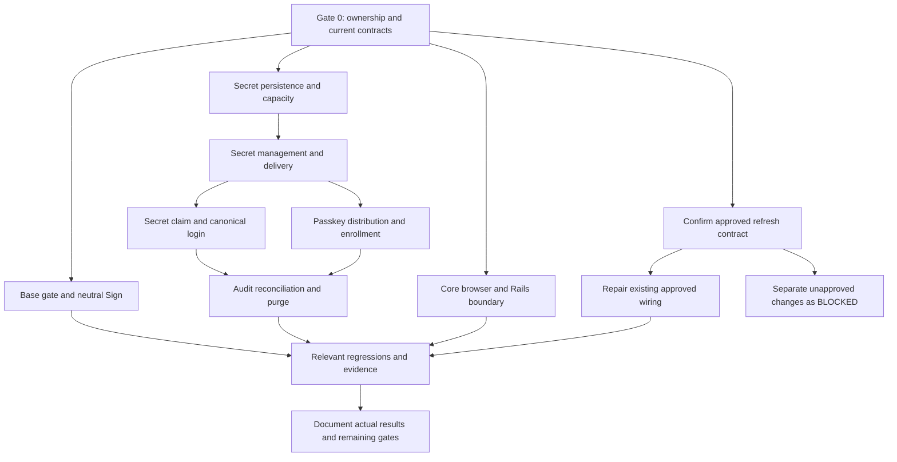

# Base, app Secret, and Core integration analysis

Recorded: 2026-10-03 (UTC). Scope: `seahal/umaxica-apps-jit-global` and the
corresponding Core work in `seahal/umaxica-apps-edge`.

This document consolidates dependencies and implementation gates. It is not a
runtime report or an active task ledger. Accepted work remains tracked through the
repository's issue process. No issue, code, database, or external configuration is
changed by creating this analysis.

The target decisions and scoped replacements are canonical in
[contract precedence](../../adr/base-secret-core-contract-precedence.md).
The [acceptance catalog](base-secret-core-acceptance.md) supplies completion criteria.
Older implementation instructions are input material, not competing current contracts.

Companion decision-support material covers
[customer copy](base-secret-core-customer-copy.md),
[browser verification procedures](base-secret-core-browser-scenarios.md),
[remaining decision gates](base-secret-core-decision-gates.md), and
[operations and rollback readiness](base-secret-core-operations-readiness.md).
These are review inputs, not executed tests or deployed runbooks.

## Starting state and authorization

The documentation checkout is `feature` at
`bab7343c9de26b86f4ab22ae18ca0074db045394`, with substantial existing staged,
unstaged, or untracked work to preserve as applicable. Parallel implementation may
change this working tree; this analysis does not certify its results. Record Rails
and Edge HEAD, relevant dirty state, and fixed versions independently at execution.

Earlier runtime observations identify Dashboard routes at each RootsController's
show action, AuthenticationBase as the selected gate/issuer, Client and old Secret
in app_zenith, and Token/SignInFlow in app_ticket. These are investigation leads
whose references must be rechecked against the execution checkout, not a substitute
for current evidence. Model annotations do not establish physical ownership.

This task authorizes documentation. Implementation authorization must be obtained
from the active implementation task. Forbidden operations remain Git worktrees,
reset/stash/checkout/clean, unrelated rollback, direct GitHub editing, push, PRs,
deployment, real credential use, external sending, and destructive shared-DB work.

## Gate 0: shared investigation

Complete the common ownership and authority investigation before dependent changes:

- Load root AGENTS.md and only the indexed rules matching each task. Inspect
  current ADR amendments, README routing, routes, callbacks, override/include order,
  response adapters, and public-boundary tests.
- Record each repository separately. If Edge is unavailable, keep Rails-independent
  work available and mark Edge verification unperformed.
- Trace canonical login persistence: model, actual connection, transaction, lock,
  commit, cookie, durable receipt, login-state authority, and logout/revoke paths.
- Map each Step-Up operation's requirement, allowed methods, scope, freshness,
  actor/session/transaction binding, and consumption. Retained AAL code does not
  establish the operation's actual authorization contract.
- Trace Core session GET and refresh POST through request-source checks, cookie
  resolution, rotation/replay, persistence, response, and browser continuation.
  Route existence alone does not establish a sanctioned wire contract.
- Inventory old app Secret tables, columns, dependent references, migration paths,
  structures, seeds, fixtures, invariants, and cleanup ownership. Distinguish older
  migration directory names from actual database ownership.

Report concrete contradictions early. An unresolved gate blocks its dependents,
not every lane. Do not infer missing values or introduce a fallback.

## Dependency structure

The graph describes dependencies, not agent delegation or permission to execute.
Base does not wait for the Secret rebuild; Core boundary work does not wait for a
new refresh decision. Shared authentication files require coordinated changes and
current-diff review rather than independent competing rewrites.

## Lane A: Base

Protect Dashboard show with the existing action-specific authentication DSL. Stop
anonymous requests before protected business-resource access. Preserve public Home,
authenticated Home behavior, selector checks, and authorization verification.

Reuse response handling appropriate to HTML, Inertia, JSON/API, and HEAD. Route
document navigation to same-Base `/sign`. GET displays without admission issuance;
POST explicitly starts and refuses authenticated new starts. Reuse local admission,
configured signed Jump, Auth evidence, Base session establishment, and return
consumption. Never call another controller action to simulate the POST.

Trace return validation, storage, session transition, consumption, and final location.
Distinguish a verified default Dashboard return from original-fullpath restoration.
If the latter needs a new protocol, isolate that requirement as BLOCKED. Preserve
permission denials, resource-hidden 404s, restricted sessions, and dependency errors.

## Lane B: app Secret

1. **Persistence and audit foundation.** Rebuild only old app Secret schema with
   explicit DDL; align structures, seeds, fixtures, and ownership. Model confirmation,
   claim, consumption, revocation, and retention as facts. Use unique lookup/public
   identifiers and database constraints. Add source outbox with allowlisted audit
   facts. Keep Client, Passkey, sessions, Chronicle history, and com/org data intact.
2. **Capacity and issuance.** On the writer, lock Client in one documented lock
   order and use DB time. A counts usable confirmed unclaimed credentials; R counts
   live pending reservations. Account suspension does not free capacity. Permit at
   most one pending issuance per Client; retry the same authorized operation and
   explicitly reject a different competing one. Expired reservations stop counting
   even if cleanup jobs have not run, and cannot subsequently confirm.
3. **Management and delivery.** Implement normal-authenticated owned list/detail;
   Step-Up-protected one-item addition, name-only edit, and immediate logical
   deletion/revocation. Recheck authorization on presentation and confirmation.
   Use encrypted short-lived server payload and explicit presentation; no plaintext
   URL, cookie, browser storage, logs, or Inertia history. Confirm the exact presented
   set atomically. Separate ordinary retries from explicit replacement attempts.
4. **Passkey integration.** Separate app from shared legacy top-up without changing
   com/org quantities or policies. Apply 2/1/0 to both enrollment and signed-in
   registration at reservation time. Supply server-determined 19/20 notices through
   I18n and inline props. Preserve registered Passkey versus delivery-pending versus
   confirmed/omitted/interrupted facts. Enrollment finalizes only after confirmation
   or normal omission; signed-in delivery failure does not delete its Passkey.
5. **Sign in.** Provide canonical Auth app GET/POST `/sign/in/secret`, remove app's
   Emergency entry, retain org's. Resolve full-value lookup digest and verify the
   whole secret; never require a remembered public_id or search only the latest row.
   Preserve input limits, CSRF, guest-only, handoff, region, online defenses, and
   indistinguishable credential rejection. Infrastructure errors remain distinct.
6. **Claim and session.** Bind irreversible atomic Zenith claim to credential,
   Client, trusted operation, and browser flow. Continue durable Ticket flow through
   canonical login. Reconcile same-operation results from persisted commit evidence,
   including wait, cancellation, expiry, unknown result, and delayed callback races.
   Never restore eligibility or directly create tokens. Consumption does not revoke
   the newly established session through a generic credential-change hook.
7. **Delivery and reclamation.** Recover outbox delivery through periodic scanning,
   deduplicate in Chronicle, and audit terminal facts before physical deletion.
   Commit deletion with its surviving purge outbox. Define cleanup for candidates,
   encrypted payload, reservations, and terminal claims/receipts, preserving live
   continuation evidence, legal holds, enforcement, and kill switches.

Manual and Passkey issuance share capacity ownership and policy. They do not share
an issuance quantity. Saved confirmation is neither a Step-Up success nor a login.
Secret loss does not imply a new account-recovery entitlement.

## Lane C: Core

Establish the actual configured public-path ownership table before client changes.
Rails owns credentials, refresh/revoke, authorization, and business APIs; browser
requests reach Rails-owned public Core paths without a Worker proxy. Ordinary
TanStack receives no Cookie and emits no authentication Set-Cookie.

Keep common SSR; hydrate with the same unconfirmed state. Browser state distinguishes
checking, available, confirmed reauthentication-required, and temporary failure.
Reject unexpected API HTML/redirects, constrain request destinations/methods, and
do not replay uncertain writes. Discard stale responses after logout, subject switch,
or reauthentication, including responses whose cancellation failed.

Preserve fixed-version Cookie, exact configured Origin, CSRF, Fetch Metadata,
protocol exceptions, resource authorization, rate limits, safe rendering, CSP,
and credential filtering. Use synthetic sentinels for disclosure checks. Cache
fingerprinted assets only; user-specific dynamic data must not enter shared cache.

Separate legacy Core dispatcher removal from external routing cutover. Prepare a
reviewable target difference without enabling a replacement proxy or removing a
currently required deployed entrance prematurely. Misrouted Rails requests fail
closed, rather than returning application HTML as success.

## Conditional refresh lane

**Existing-contract repair:** reproduce normal browser access after access expiry
or access-cookie disappearance with valid continuation credentials. Repair only
wiring demonstrably required by an approved current contract. Verify parent/RP
continuity, replay, concurrent requests, response order/loss, and logout races.

**Separate decision:** mark new endpoint, GET mutation, timer/global-401 refresh,
new rotation/retry/grace/result-storage, or access-only semantic changes BLOCKED.
The conflict between credential-pair cleanup and access-only expiry must be resolved
from the actual contract; preserve confirmed-invalid cleanup meanwhile.

Do not extend absolute expiry, authentication time, or Step-Up freshness. Keep
refresh credential presence distinct from authorization and access-token validity.

## Gates and convergence

| Area | Gate |
| --- | --- |
| Read-only investigation | Authorized by the investigation task; report actual facts. |
| Independent local implementation | Requires the active change task's authorization and TDD; this documentation task does not grant it. |
| Destructive Secret DDL | Concrete destruction scope, actual ownership, migration path, disposable connection, risk and recovery approval must be established before execution. |
| Unresolved expiry settings | Reuse a demonstrated equivalent contract or obtain an explicit independent setting; block dependent actions only. Never borrow Emergency's five minutes. |
| New refresh/return protocol | BLOCKED pending a separate accepted contract. |
| Production/shared DB, external writes and deployment | Outside this local task. |

Validate public boundaries with meaningful failing tests before minimum changes.
Use repository Minitest/Vitest/Playwright/Hurl procedures as applicable, writer DB
connections and barriers for concurrency, and browser tests for cookie/history
behavior. Environment failures are not TDD Red. Do not skip assertions, weaken
gates, directly test private methods, or mock authentication success.

Converge with risk-appropriate regressions across all three affected Base surfaces
and unchanged com/org Secret behavior. Reconcile ADR backlinks and indexes with
concurrent editors; add implementation-specific Secret and count-policy ADR/docs
when supported by the final design. Preserve the deferred CloudFront/routing plan;
if the supplied plan is unavailable, record that absence instead of inventing its
contents. Record executed results with full SHA, dirty state, and timezone.

Rollback is a reviewed local code change preserving newer security defenses.
An app Secret rebuild cannot restore discarded old credential data. Infrastructure
cache/routing checks and browser completion remain separate from local test success.
