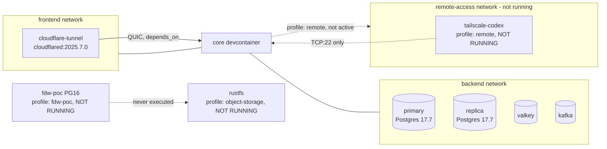
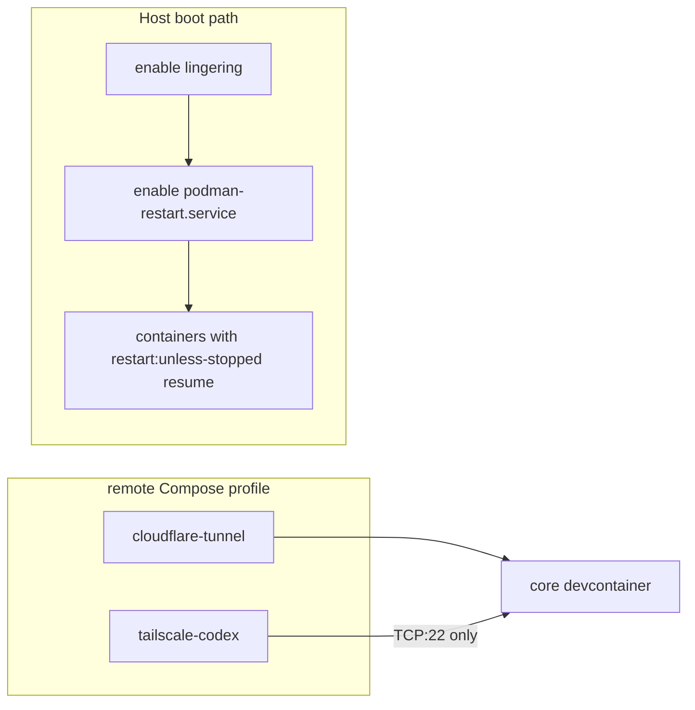

# Project Umaxica Linux Host Data Platform and Network Sidecar Audit

Date: 2026-07-21. Read-only audit performed directly on the Linux host, outside the Rails
devcontainer.

## 1. Executive summary

| Area                                              | Verdict                                                                                |
| ------------------------------------------------- | -------------------------------------------------------------------------------------- |
| Data platform (Postgres primary/replica topology) | READY                                                                                  |
| pg_cron readiness                                 | PARTIALLY READY                                                                        |
| FDW/RustFS local PoC readiness                    | NOT READY (never executed)                                                             |
| Aurora portability                                | BLOCKED (design choice unresolved; native FDW path likely disqualifying)               |
| cloudflared readiness                             | PARTIALLY READY (running, no opt-in profile)                                           |
| Tailscale readiness                               | PARTIALLY READY (well-scoped scaffold, currently not running)                          |
| Restart/recovery readiness                        | NOT READY (lingering disabled, `podman-restart.service` disabled)                      |
| Rails/host security boundary                      | PARTIALLY READY (no obvious cross-boundary secret leak found, not exhaustively probed) |

## 2. Scope and safety statement

All commands executed were read-only: `git status/log/grep`, `find`,
`podman ps/inspect/version/info`, `podman network/volume ls`,
`systemctl --user list-unit-files/status`, `ss -lntup`, and `SELECT`/`SHOW` statements attempted
against PostgreSQL (blocked by auth, see §6). No `podman compose up/down/restart`, no builds/pulls,
no container start/stop, no SQL writes, no systemd enable/start, no Tailscale/Cloudflare mutations
were run.

Not inspected: `pg_hba.conf`/config contents on the replica in detail; `cron.job`/
`cron.job_run_details` (blocked, see §6); container/host logs beyond what `podman ps` surfaces
(bounded `podman logs` reads were not executed this pass); RustFS/Tailscale running state (neither
container was running, so `tailscale status`/RustFS bucket enumeration were not applicable); full
`podman info` storage/network-backend fields (only host/OS-level fields were captured).

## 3. Verified host facts

- Date/time: `2026-07-21T21:09:46+09:00` (JST).
- OS: Arch Linux, rolling (`BUILD_ID=rolling`), kernel `7.1.4-arch1-1`.
- User: `mslo`, uid 1000, in groups including `docker`, `wheel`; **lingering: `Linger=no`**.
- Podman: client/engine `6.0.1`, rootless, cgroup v2, cgroup manager `systemd`, database backend
  `sqlite`.
- Compose provider: external `docker-compose` plugin, Compose spec version `5.3.1` (`podman compose`
  shells out to `/usr/lib/docker/cli-plugins/docker-compose`, not the native `podman-compose` Python
  tool).
- `podman.socket`: active/listening (enabled). `podman-restart.service`: **disabled**.

## 4. Repository and Git state

- Working tree: `develop` branch, HEAD `f120790d1`, tracking `origin/develop`.
- Remote `origin` = `https://github.com/seahal/umaxica-app-jit` — **not** `umaxica-apps-jit-global`
  as assumed in the task brief. This is the actual local checkout; reconcile the name discrepancy
  before further planning.
- Working tree has pre-existing, unrelated in-progress changes (publishing legacy table drop /
  preference transport work, several modified/untracked files). None of these were touched by this
  audit.
- No worktrees beyond the primary checkout. Many long-lived local/remote branches exist (dependabot,
  split/_, backup/_, authority-recovery-*) — not relevant to this audit.
- `docker/fdw-poc/` is **present and tracked** on `develop` (introduced around commit `2e4fb60d8` /
  refined in `6cbba7e60`), not merely historical or on another branch.
- `docker/tailscale/` (Tailscale `serve` config for the `tailscale-codex` sidecar) is also present
  and tracked.
- Cloudflare-related work has extensive history (`cf14c8e34` "trying to use cloudflare
  tunnel/access" onward); current tracked state is in `compose.yaml` and
  `docs/operations/cloudflare-private-origin.md`,
  `adr/org-cloudflare-access-authentication-layer.md`.
- pg_cron: referenced in `docker/psql-pub/Dockerfile`, `docker/psql-pub/postgresql.conf`,
  `.devcontainer/setup-db.sh`, and `config/initializers/pg_cron_test_fallback.rb` (a Rails
  test-environment fallback, not a host artifact).
- RustFS: referenced in `compose.yaml` (base, not devcontainer-only), `.env.example`, and
  `docs/operations/local-object-storage-rustfs.md`.

## 5. Current Compose topology

Compose project: `umaxica-apps-global-dc`, config files: `compose.yaml` +
`.devcontainer/compose.override.yml` + two transient devcontainer-CLI generated files under
`/tmp/devcontainercli-mslo/`. This confirms the running stack was started via **VS Code/Codex
`devcontainer up`**, not a bare `podman compose` invocation, Quadlet, or systemd.

Running containers (`podman ps -a`):

| Container                                    | Image                                        | Status                       | Networks                                                  |
| -------------------------------------------- | -------------------------------------------- | ---------------------------- | --------------------------------------------------------- |
| `global-devcontainer-primary`                | local build `umaxica-apps-global-dc-primary` | Up, healthy                  | (backend, per compose)                                    |
| `global-devcontainer-replica`                | local build `umaxica-apps-global-dc-replica` | Up (not yet healthy-labeled) | (backend, per compose)                                    |
| `global-devcontainer-core`                   | local build `umaxica-apps-global-dc-core`    | Up                           | backend, frontend, observability, remote-access, `_outer` |
| `global-devcontainer-valkey`                 | `valkey/valkey:8.0-alpine3.22`               | Up, healthy                  | backend                                                   |
| `umaxica-apps-global-dc-kafka-1`             | `confluentinc/cp-kafka:7.9.0`                | Up, healthy                  | (per compose)                                             |
| `umaxica-apps-global-dc-cloudflare-tunnel-1` | `cloudflare/cloudflared:2025.7.0`            | Up                           | `frontend` only                                           |

RustFS and `tailscale-codex` are **not running** — both are profile-gated
(`object-storage`/`fdw-poc` and `remote` respectively) and were not started by the plain
`devcontainer up`.

Networks present: `umaxica-apps-global-dc_{backend,frontend,observability,remote-access}` plus
`umaxica-apps-global_outer` (external-flagged bridge) and the default `podman` bridge.
`remote-access` exists even though `tailscale-codex` isn't running (network created eagerly by
Compose).

`cloudflare-tunnel` container: `depends_on: core:service_started:false` (label shows the dependency
but not currently gating a hard start-order requirement in this reading — verify semantics before
relying on it), attached only to `frontend`, restart policy `unless-stopped`, entrypoint
`cloudflared --no-autoupdate`, command `tunnel --protocol quic run`. Env includes `TUNNEL_TOKEN`
(value not printed) — sourced from `${CLOUDFLARED_TOKEN}` per `compose.yaml:579`, i.e. the host's
`.env`/shell environment, not a file mount.

`primary` mounts (host paths, bind mounts): `docker/psql-pub/pg_hba.conf`, `docker/psql-pub/` (as
`docker-entrypoint-initdb.d`), `docker/psql-pub/postgresql.conf` — all repo-tracked config, no
secret files bind-mounted into Postgres beyond what compose env supplies. Restart policy:
`unless-stopped`.

## 6. PostgreSQL and pg_cron

Image: `docker.io/library/postgres:17.7-bookworm` base (`docker/psql-pub/Dockerfile`), confirming
the task brief's PostgreSQL 17.7 assumption. `postgresql-17-cron` is installed via the official
`apt.postgresql.org` `pgdg` repo — matches the brief.

`docker/psql-pub/postgresql.conf` currently has:

```
shared_preload_libraries = 'pg_stat_statements,pg_cron'
cron.database_name = 'db'
```

This **differs from the task brief's assumption** (`'pg_stat_statements,auto_explain,pg_cron'`). A
comment in the file (line 137, Japanese) instructs restoring `auto_explain` and restarting primary —
i.e. `auto_explain` was deliberately, temporarily dropped from the preload list, not a stale
assumption. Treat "no `auto_explain`" as the current ground truth and the three-library form as a
known pending revert, not a discrepancy to silently resolve.

**Runtime SQL introspection was blocked.** `pg_hba.conf` (mounted, read) requires `scram-sha-256`
for every entry (`local`, `host 127.0.0.1/32`, `host ::1/128`, `host all`) — there is no
`trust`/`peer` path. Connecting as `postgres` failed both with no password and with `PGPASSWORD` set
from the container's own `POSTGRES_PASSWORD` env var (`FATAL: password authentication failed`),
meaning the live DB password does not match the container-declared env value (likely rotated
post-init, or the env var isn't what initialized the role). Further password attempts were
deliberately not made to avoid appearing as credential brute-forcing. **Consequence: items 1–10 of
the pg_cron readiness checklist (extension actually created, jobs present, job run history, replica
state, log evidence of pg_cron worker startup) are UNVERIFIED this pass** — config-level
installation and preload are confirmed; live extension/job state is not.

### Rails database topology impact

Not independently re-derived this pass (no `config/database.yml` read); given
`cron.database_name = 'db'`, the pg_cron metadata database is fixed to whichever physical database
is named `db` on the primary. This needs to be cross-checked against `config/database.yml` in a
follow-up before deciding whether `cron.schedule_in_database` is required for a target database
other than `db`.

## 7. Existing FDW/RustFS scaffold audit

`docker/fdw-poc/` is a real, previously-designed scaffold, **explicitly marked "Pending manual
execution"** in its own design doc (`docs/experiments/postgres-s3-fdw-poc.md`): "the actual build
and query run require `podman` container-build access that was not available in the environment that
authored this document... Do not treat this document as evidence of feasibility until the Results
section is populated."

Key facts from the doc and `docker/fdw-poc/compose.fdw-poc.yml`:

- Mechanism: **Supabase Wrappers** `s3_fdw` (Rust, `pgrx`-based), a real PostgreSQL foreign data
  wrapper — this is architecture **A** (foreign tables directly over S3/RustFS objects), not
  DuckDB-mediated (B) or batch import/export (C).
- Read-only wrapper: no INSERT/UPDATE/DELETE/TRUNCATE support.
- **Pinned to PostgreSQL 16**, isolated from the production `psql-pub` image (17.7), because
  Wrappers' PG17 support was unconfirmed at authoring time. This is a real version mismatch versus
  the production database and must be re-verified against current Wrappers docs before treating PG17
  as viable.
- Fully isolated: separate tmpfs-backed Compose overlay (`fdw-poc` profile), own Dockerfile, never
  modifies the production `psql-pub` image.
- Depends on RustFS being started first (`object-storage` profile) plus fixture generation via
  `docker/fdw-poc/fixtures/generate_fixtures.sh`.
- `docker/fdw-poc/smoke/run_smoke_checks.sql` exercises `CREATE FOREIGN DATA WRAPPER`,
  `CREATE SERVER`, `CREATE FOREIGN TABLE`, and read-only `SELECT`s across CSV/JSONL/Parquet,
  including missing-object and bad-credential negative cases — a real semantic FDW test, not just
  SQL-through-another-engine.
- **No evidence it has ever been executed**: RustFS is not running, no FDW-poc image/ container
  exists in `podman images`/`podman ps -a`, and the doc self-reports zero populated results.

No other DuckDB/`httpfs`/`parquet`/`aws_s3`/`aws_commons` scaffold was found outside this one PoC.

## 8. Aurora compatibility matrix

Not independently researched against live AWS documentation this pass (no WebFetch/ WebSearch
performed). Based on the PoC doc's own framing and general knowledge of the ecosystem, flagged for
verification in the next phase:

| Architecture                        | Locally buildable            | Locally runnable | Aurora-compatible                                                                                                                                       | Requires custom native ext       | Requires superuser      | Requires `shared_preload_libraries` |
| ----------------------------------- | ---------------------------- | ---------------- | ------------------------------------------------------------------------------------------------------------------------------------------------------- | -------------------------------- | ----------------------- | ----------------------------------- |
| A: Wrappers `s3_fdw` (pgrx/Rust)    | Yes (unverified — never run) | Unverified       | **Likely NOT supported** — Aurora PostgreSQL does not allow arbitrary custom native (non-RDS-provided) extensions requiring `pgrx`/`cargo pgrx install` | Yes                              | Likely yes              | Yes (Wrappers preload)              |
| B: DuckDB-mediated                  | Not scaffolded here          | N/A              | N/A — DuckDB isn't a Postgres extension path at all on Aurora                                                                                           | N/A                              | N/A                     | N/A                                 |
| C: batch import/export              | Not scaffolded               | N/A              | Aurora supports `aws_s3`/`aws_commons` import/export extensions (RDS-provided)                                                                          | No (uses RDS-blessed extensions) | Typically rds_superuser | No                                  |
| D: Rails S3 client + metadata table | Trivial                      | Trivial          | Fully compatible (no Postgres extension involved)                                                                                                       | No                               | No                      | No                                  |

This table must be treated as **provisional** — it is not backed by a citation from official
AWS/PostgreSQL docs read during this session. Confirming or refuting "Wrappers is disqualifying on
Aurora" against current AWS RDS/Aurora extension allowlist documentation is a required next step
before any FDW investment.

## 9. cloudflared audit

- Running: yes, `cloudflare/cloudflared:2025.7.0`, matches the task brief.
- No opt-in profile — it starts with every plain `devcontainer up` / `podman compose up` of the base
  stack.
- `depends_on: core` is present in `compose.yaml`.
- Network: `frontend` only (not `backend`, not `remote-access`) — narrower attack surface than
  "reaches the whole stack."
- `TUNNEL_TOKEN` sourced from host env var `CLOUDFLARED_TOKEN` (existence not verified this pass
  without printing shell env; not read to avoid touching secret values unnecessarily).
- Protocol: QUIC (`tunnel --protocol quic run`), `extra_hosts: host.docker.internal:host-gateway`
  present as brief assumed.
- Cloudflare Access policy state is **not verifiable locally** — requires the Cloudflare
  dashboard/API, out of scope for a read-only host audit.

## 10. Tailscale audit

- `tailscale-codex` sidecar exists, tracked, in `.devcontainer/compose.override.yml`, gated behind
  the **`remote` Compose profile** — it is not created/pulled/started by plain `devcontainer up`
  (confirmed: no tailscale container in `podman ps -a`).
- Networking mode: **userspace** (`TS_USERSPACE: "true"`), no `/dev/net/tun`, no
  `network_mode: service:` sharing — it forwards only tailnet port 22 to `core:22`; SSH itself
  terminates at `core`'s own sshd (`REMOTE_SSHD=1` opt-in flag). This is the narrowest of the two
  possible designs the brief asked about (§ open question 4): current code already exposes only
  `core`, not a broader internal network. Rest of stack is not reachable from `tailscale-codex` — it
  is on `remote-access` only. This is a scaffold-embedded design decision already made, not an open
  question.
- State persistence: named volume `tailscale-codex-state`, documented as surviving sidecar
  recreation to allow the auth key to be revoked after first registration and the sidecar later
  recreated cleanly.
- `TS_AUTHKEY` sourced from an **untracked, host-managed** file (`~/.config/umaxica/tailscale.env`,
  `chmod 600`, per compose comment) — never enters the repo. Not verified whether this file
  currently exists on this host (not read, to avoid touching a secrets file unnecessarily beyond
  existence-check scope; can be checked with a plain `test -f` in a follow-up).
  `TS_AUTH_ONCE: "true"` — ephemeral, single-use registration flow by design. Serve config:
  `TS_SERVE_CONFIG: /etc/tailscale/serve/serve.json`, backed by tracked `docker/tailscale/serve/`
  directory (contents not read this pass).
- Since the container is not running, `tailscale status --json` could not be queried; no live
  identity/Serve/Funnel state to report.

## 11. Secrets and privilege boundary

- No host SSH keys, GitHub credentials, Codex state, Claude state, or Podman socket were found
  bind-mounted into `core`, `primary`, `replica`, `cloudflare-tunnel`, or `tailscale-codex` based on
  the mounts inspected (`primary`'s three mounts are all repo-tracked config; `core`'s
  workspace/package.json/.devcontainer mounts are read-only repo bind mounts plus the `remote-sshd`
  volume and the operator-managed `agent-authorized-keys` file, which is authorized_keys content,
  not a private key).
- `tailscale.env` and `agent-authorized-keys` are both explicitly documented as operator-managed,
  host-side, untracked files outside the repo — consistent with keeping secrets out of git.
- Full enumeration of every mount on every container (not just primary/core/cloudflare-tunnel) was
  not completed this pass; `replica`, `valkey`, `kafka` mounts were not individually inspected.
- No immediate secret leak was identified, but this is not an exhaustive privilege-boundary audit —
  treat as PARTIALLY READY, not a clean bill of health.

## 12. Restart and disaster-recovery analysis

- **`Linger=no`** for user `mslo` — without lingering, user-session services (including the rootless
  Podman socket and any containers) do **not** start automatically at boot before an interactive
  login; they only start once the user logs in (console/SSH) and the systemd user instance
  activates.
- `podman-restart.service` is **disabled** (present, loaded, but not enabled) — this is the unit
  that would otherwise start all containers with `restart: unless-stopped`/`always` policy on
  user-session startup. With it disabled, `restart: unless-stopped` on `primary`, `replica`,
  `cloudflare-tunnel`, and `tailscale-codex` only takes effect **after** those containers are
  already running (i.e., protects against an in-session crash) — it does **not** protect against a
  full host reboot.
- The stack was started via `devcontainer up` (per Compose project config-file evidence in §5,
  referencing `/tmp/devcontainercli-mslo/...` transient files), not a persistent Quadlet or systemd
  unit — after reboot, someone must re-run `devcontainer up` (or an equivalent `podman compose up`)
  manually.

| Service                                     | Post-reboot prediction                                                                                              | Evidence                                                                                                      |
| ------------------------------------------- | ------------------------------------------------------------------------------------------------------------------- | ------------------------------------------------------------------------------------------------------------- |
| `primary`/`replica`/`valkey`/`kafka`/`core` | **Definitely requires manual action**                                                                               | No lingering, `podman-restart.service` disabled, no Quadlet units found, stack launched via `devcontainer up` |
| `cloudflare-tunnel`                         | **Definitely requires manual action**                                                                               | Same as above; `restart: unless-stopped` alone is insufficient without lingering + `podman-restart.service`   |
| `tailscale-codex`                           | **Definitely requires manual action**, and additionally requires the operator to explicitly pass `--profile remote` | Profile-gated; not started by default `devcontainer up` even after manual restart                             |
| `rustfs`                                    | **Definitely requires manual action**, requires `--profile object-storage`                                          | Profile-gated                                                                                                 |

Database data itself (primary/replica volumes) is presumed to survive a reboot as it is Podman named
volumes, not tmpfs — consistent with prior session knowledge ([[project_podman_restart_wipes_tmpfs]]
warns specifically about `podman compose restart` wiping _tmpfs_, which is a different failure mode
than a host reboot; not re-verified this pass which of `primary`/`replica` volumes are tmpfs vs.
persistent-backed).

## 13. Current-state Mermaid diagram



## 14. Recommended target-state Mermaid diagram (proposal, not current fact)



Moving `cloudflare-tunnel` into a shared `remote` profile alongside `tailscale-codex` is a proposal
only — it is an open decision (see §16), not yet implemented.

## 15. Evidence log

| Claim                                                         | Command/file                                                                             | Confidence | Type           |
| ------------------------------------------------------------- | ---------------------------------------------------------------------------------------- | ---------- | -------------- |
| Lingering disabled                                            | `loginctl show-user mslo` → `Linger=no`                                                  | High       | Runtime        |
| `podman-restart.service` disabled                             | `systemctl --user status podman-restart.service`                                         | High       | Runtime        |
| PG17.7-bookworm base, `postgresql-17-cron` installed          | `docker/psql-pub/Dockerfile`                                                             | High       | Static         |
| `shared_preload_libraries` lacks `auto_explain` currently     | `docker/psql-pub/postgresql.conf:137-141`                                                | High       | Static         |
| Postgres SQL introspection blocked                            | `podman exec ... psql` auth failures (scram, wrong password)                             | High       | Runtime        |
| `docker/fdw-poc` never executed                               | `docs/experiments/postgres-s3-fdw-poc.md` self-reported status; no image/container found | High       | Static+Runtime |
| `tailscale-codex` not running, profile-gated                  | `podman ps -a` (absent), `.devcontainer/compose.override.yml:181-226`                    | High       | Runtime+Static |
| `cloudflare-tunnel` running, no profile                       | `podman ps -a`, `compose.yaml:571-585`                                                   | High       | Runtime+Static |
| Remote `origin` is `umaxica-app-jit`, not the task-brief name | `git remote -v`                                                                          | High       | Runtime        |

## 16. Open questions — resolved via interview

All seven blocking decisions were resolved through a direct interview conducted in the coding-agent
conversation (`grill-me-with-docs` is unavailable in this environment; see §19). See §19 "Decision
record" for full rationale per decision.

1. **S3/object-storage semantics** — Investigation target is architecture A (PostgreSQL
   foreign-table semantics via the existing `docker/fdw-poc` scaffold). Production adoption remains
   undecided and conditional on Aurora compatibility (§19.1).
2. **Aurora compatibility threshold** — Local FDW experimentation remains valid regardless of
   outcome; production must use only Aurora-officially-supported features. Self-managed PostgreSQL
   solely to preserve the FDW layer is out of scope (§19.2).
3. **pg_cron / scheduled logical-deletion ownership** — Retired as a lifecycle-operation candidate.
   SolidQueue (`RetentionPurgeJob`, `config/recurring.yml`) is already the sole, fully-implemented
   owner of both logical deletion (event-driven, app code) and physical deletion (scheduled, every
   15 min, production). `cron.database_name = 'db'` matches no physical database in the current
   multi-database topology and is stale/inconsistent — not changed during this interview; flagged as
   a later implementation task. A minimal pg_cron PoC may still run, scoped strictly to
   infrastructure/Aurora capability validation using a disposable table, fully decoupled from any
   production lifecycle model (§19.3).
4. **Tailscale exposure scope** — SSH (TCP:22→`core:22`, existing) plus a new tailnet-only HTTPS
   Serve route to Rails at `core:3000`. No Vite:3036 route unless HMR is proven to require it. No
   broader Compose-network access, no Funnel (§19.4).
5. **cloudflared/Tailscale profile structure** — Independent `tailscale` and `tunnel` profiles on
   their respective services, plus a combined `remote` convenience profile. Plain startup enables
   neither (§19.5).
6. **Reboot recovery policy** — Custom, closest to "minimal dependency chain auto-starts":
   `primary`, `replica` (if Rails startup requires it), `valkey`, `core` (incl. its sshd),
   `tailscale-codex`, and (once designed) the persistent Claude/Codex remote-control process form
   one auto-recovering remote-development chain. `cloudflare-tunnel`, RustFS, the FDW PoC, the
   pg_cron PoC, Kafka (unless proven required), observability, pgAdmin, and TinyRDM remain
   manual/profile-gated. Requires an explicit host-level startup unit, not bare
   `restart: unless-stopped`; tmpfs-backed primary/replica means "auto-recovery" is auto-_recreate_,
   not data survival (§19.6).
7. **Rails devcontainer credential boundary** — No fourth "agent" Compose service. The Claude/Codex
   remote-control process runs inside the existing `core` service, with credential isolation
   enforced at the process/mount level: least-privilege credential source, no host SSH private
   keys/Podman socket/broad cloud/unnecessary GitHub credentials, explicit startup/logging/failure
   behavior, conservative handling of concurrent repository writes (no dependency installs, no
   reverting unrelated changes without explicit instruction) (§19.7).

## 17. Proposed future implementation phases

See §20 for the full phased implementation plan (Phase A: host data platform, Phase B: host network
sidecars, Phase C: Rails internal implementation), reflecting the decisions in §19. This section is
retained for the original phase groupings; §20 supersedes it with concrete files, commands,
privileges, and acceptance criteria per the interview outcome.

## 18. Exact next safe commands

| Command                                                                                                                                                                                  | Classification                                                                                    |
| ---------------------------------------------------------------------------------------------------------------------------------------------------------------------------------------- | ------------------------------------------------------------------------------------------------- |
| `podman exec global-devcontainer-primary sh -c 'PGPASSWORD=... psql -U postgres -d db -Atc "SELECT extname,extversion FROM pg_extension;"'` (with a correct, operator-supplied password) | read-only                                                                                         |
| `podman logs --tail 200 global-devcontainer-primary`                                                                                                                                     | read-only                                                                                         |
| `test -f ~/.config/umaxica/tailscale.env && echo present`                                                                                                                                | read-only                                                                                         |
| `git log --all --oneline -- docker/fdw-poc/Dockerfile` (full file history)                                                                                                               | read-only                                                                                         |
| `podman compose -f compose.yaml -f .devcontainer/compose.override.yml --profile object-storage up -d rustfs-permissions rustfs`                                                          | container start (local mutation)                                                                  |
| `podman compose ... --profile fdw-poc up -d fdw-poc`                                                                                                                                     | container start (local mutation)                                                                  |
| `podman compose ... --profile remote up -d tailscale-codex`                                                                                                                              | container start, tailnet registration (local mutation + external device may be needed to approve) |
| `loginctl enable-linger mslo`                                                                                                                                                            | local mutation (systemd state)                                                                    |
| `systemctl --user enable podman-restart.service`                                                                                                                                         | local mutation (systemd state)                                                                    |
| Cloudflare Access dashboard/API review                                                                                                                                                   | external-device / cloud validation                                                                |

None of these were executed beyond the already-completed read-only commands in this audit.

## 19. Decision record

`grill-me-with-docs` is not available in this environment (no matching skill or `.agents/harnesses/`
entry). The interview was conducted directly in the Claude Code conversation against this document,
one blocking decision at a time, per the same rules (evidence-first, no silent adoption of the
recommended default, blockers vs. policy vs. preference distinguished).

### 19.1 — S3/object-storage semantics

- **Decision:** Investigation target is architecture A — PostgreSQL foreign-table semantics,
  continuing the existing `docker/fdw-poc` scaffold (Supabase Wrappers `s3_fdw` against RustFS).
  Production adoption is **not** decided by this choice.
- **Rationale:** The original intent behind `docker/fdw-poc` was specifically to answer the FDW
  feasibility question; reinterpreting the target as architecture C (Rails S3 client) would answer a
  different, easier question without resolving the one the scaffold was built for.
- **Rejected alternatives:** C (Rails S3 client + metadata only) as the _investigation_ target —
  valid as a production fallback, but doesn't test FDW feasibility. B (batch import/export) — not
  what the existing scaffold tests.
- **Consequence:** `docker/fdw-poc` is worth executing. Its result feeds §19.2, not the reverse.

### 19.2 — Aurora compatibility threshold

- **Decision:** Local FDW experimentation remains legitimate on its own. Production must use only
  Aurora-officially-supported features. A separate self-managed PostgreSQL instance solely to keep
  architecture A alive in production is out of scope unless a distinct future decision changes the
  production database architecture.
- **Rationale:** Production runs on Aurora PostgreSQL; introducing a second, self-managed database
  engine purely to preserve one feature is a significant new operational commitment not currently
  justified.
- **Rejected alternatives:** A (Aurora support mandatory, full stop) — converges on the same
  production outcome but forecloses legitimate non-production use of a working PoC. B (self-managed
  Postgres sidecar) — explicitly out of scope.
- **Consequence:** If Aurora doesn't officially support Wrappers/pgrx, architecture A is reported as
  locally successful but production-unsuitable, and B/C get evaluated next — without introducing a
  second database engine as an automatic fallback.

### 19.3 — pg_cron / scheduled logical-deletion ownership

- **Decision:** SolidQueue (`app/jobs/retention_purge_job.rb`, `config/recurring.yml`) remains the
  sole scheduler/orchestrator for logical and physical lifecycle deletion. pg_cron is retired as a
  candidate for this, including as a fallback or defense-in-depth mechanism.
  `cron.database_name = 'db'` (`docker/psql-pub/postgresql.conf:141`) is treated as
  stale/inconsistent with the current multi-database topology (§6, §7 confirm no physical database
  is literally named `db`) — left unchanged during this interview; corrected or removed in a later
  implementation task. A minimal pg_cron PoC may still run, but only to validate infrastructure
  capability (extension loads, jobs schedule, correct metadata-DB configuration, comparison against
  Aurora), using a disposable table, never connected to a production lifecycle model.
- **Rationale:** RetentionPurgeJob already implements both logical deletion (event-driven, app code)
  and physical deletion (scheduled, 15 min, production), with cross-database purge and legal-hold
  handling already built. No concrete gap SolidQueue can't cover was identified. Repository evidence
  contradicts the premise that pg_cron was an established decision to replace or duplicate this.
- **Rejected alternatives:** B (pg_cron covers a specific SolidQueue gap) — no such gap found. C
  (pg_cron as redundancy/backstop) — would introduce a second owner of the same operations,
  explicitly rejected.
- **Consequence:** `docker/fdw-poc` and the pg_cron PoC are two **independent** extension
  experiments — FDW answers an application-architecture question (§19.1/§19.2); pg_cron answers only
  an infrastructure/Aurora capability question. Neither should be conflated with
  `RetentionPurgeJob`/SolidQueue.

### 19.4 — Tailscale exposure scope

- **Decision:** SSH (existing TCP:22→`core:22`) plus a new tailnet-only HTTPS Serve route to Rails
  at `core:3000`. No route to Vite `core:3036` unless HMR is proven to require direct
  browser-to-Vite connectivity — test via the Rails endpoint first. No PostgreSQL, Valkey, Kafka,
  RustFS, pgAdmin, or broader `backend`/`frontend` network access. No Funnel/public exposure. Access
  gated by Tailscale identity/tags/ACL as explicit allowlisted destinations, not general network
  forwarding.
- **Rationale:** Two distinct real workflows exist — SSH-driven remote coding-agent/shell work, and
  browser-based external-device validation of the running app (Mac/phone/tablet) — SSH alone doesn't
  satisfy the second.
- **Rejected alternatives:** A (SSH only) — doesn't satisfy mobile/browser preview requirement. D
  (broader Compose network) — explicitly rejected as excess blast radius; the target remains
  service-level access to `core`, not network-level access to Compose.
- **Consequence:** `docker/tailscale/serve/*` needs a new Serve entry for `core:3000` (and only
  `core:3000` unless Vite direct-HMR need is later evidenced). Acceptance criteria: trusted Mac can
  SSH; trusted Mac/phone can open the Rails dev site over tailnet; unapproved tailnet identity
  cannot; no DB/cache/queue/broker becomes reachable; stopping `tailscale-codex` removes both remote
  paths without affecting local dev.

### 19.5 — cloudflared/Tailscale profile structure

- **Decision:** `tailscale-codex` gets `profiles: [tailscale, remote]`; `cloudflare-tunnel` gets
  `profiles: [tunnel, remote]`. Plain `devcontainer up`/`podman compose up` starts neither.
- **Rationale:** The two sidecars have different purposes, trust boundaries, credentials, and
  failure modes (personal trusted-device access vs. externally-mediated, Access-protected public
  path) and must stay independently controllable — but a real end-to-end-remote-validation workflow
  needs both together often enough to justify one convenience profile.
- **Rejected alternatives:** A (single shared `remote` profile only) — couples two different trust
  domains under one switch. B (independent profiles, no convenience profile) — reasonable but loses
  the documented combined-workflow ergonomics.
- **Consequence:** Compose edit only (profile lists on the two existing services — no wrapper
  container, no duplicate service). Must preserve: neither sidecar recreates/ restarts `core`;
  `depends_on: core` reviewed for recreation-risk semantics before reuse; reuse the existing Compose
  project (no second project); one sidecar's failure/shutdown must not affect the other;
  credentials/state stay separate; normal local dev works with no sidecar profile enabled.

### 19.6 — Reboot recovery policy

- **Decision:** Minimal remote-development chain auto-recovers: `primary` (recreated fresh from
  tmpfs, not restored), `replica` if Rails startup currently requires it, `valkey`, `core`
  (including its sshd), `tailscale-codex`, and — once its startup mechanism is designed — the
  persistent Claude/Codex remote-control process. `cloudflare-tunnel`, RustFS, the FDW PoC stack,
  the pg_cron PoC, Kafka (unless evidence proves normal Rails startup needs it), observability,
  pgAdmin, and TinyRDM remain manual/profile-gated.
- **Rationale:** The requirement is reconnecting from a trusted remote device after an unattended
  reboot without first operating the Linux desktop locally — SSH alone is insufficient because it
  terminates inside `core`, and `core` alone is insufficient without its required Postgres/Valkey
  dependencies. The public tunnel, experiments, and administrative tooling are explicitly excluded
  from unattended auto-recovery.
- **Rejected alternatives:** A (nothing auto-starts) — fails the "reconnect without local Linux
  interaction" requirement. C (full stack auto-starts) — brings back
  `cloudflare-tunnel`/experiments/tooling unattended, rejected. Plain "D" as originally framed
  (stateful-only auto-start, app services manual) — doesn't cover the actual need (must include
  `core` + SSH + Tailscale, not just databases).
- **Consequence:** Requires enabling user lingering and a user-level startup mechanism (systemd user
  service, Quadlet, or another explicit orchestration unit — to be determined in Phase B) that
  invokes the existing Compose project safely; must not create a second Compose project; must
  preserve startup ordering/health checks; sidecar startup must not recreate `core`;
  optional-service failure must not block SSH recovery; bounded logs plus a clear manual-recovery
  command on automatic-startup failure. tmpfs qualification: "auto-recovery" means containers/dev
  databases are automatically recreated and become usable, not that data survives the reboot.
  Validated only via an actual reboot in a later, separately approved implementation step.

### 19.7 — Rails devcontainer credential boundary

- **Decision:** No fourth "agent" Compose service. Target architecture stays three services for this
  concern: `core` (Rails, Vite, sshd, Claude Code, Codex, and the optional persistent remote-control
  process), `tailscale-codex` (narrowly allowlisted tailnet access to `core:22`/`core:3000`),
  `cloudflare-tunnel` (Access-protected `core:3000` origin only). Credential isolation for the
  unattended remote-control process is enforced at the process/mount level inside `core`:
  least-privilege credential source; no host SSH private keys, Podman socket, broad cloud
  credentials, or unnecessary GitHub credentials; explicit startup/logging/failure behavior; may
  share `core`'s workspace/toolchain; conservative handling of concurrent repository writes (no
  dependency installation, no reverting unrelated changes without explicit instruction).
- **Rationale:** `core` already is the complete Rails development environment with the required
  repository, toolchain, and runtime — a separate agent container would duplicate that without a
  proven need. Isolation is a process/credential-scoping problem, not a container-topology problem,
  unless later evidence proves process-level isolation inside `core` is technically insufficient.
- **Rejected alternatives:** C as originally framed (separate agent-enabled Compose
  profile/container) — superseded by this clarification; not adopted.
- **Consequence:** No new Compose service in Phase C. The concurrent `pnpm-lock.yaml` mutation
  observed at 21:12 JST during this audit (§21) is a live example of the "conservative
  concurrent-write handling" requirement — it was correctly left untouched rather than
  reverted/reinstalled/investigated.

## 20. Phased implementation plan (for approval — not executed)

### Phase A: Host data platform

**Scope:** pg_cron infrastructure PoC (§19.3) and FDW/RustFS PoC (§19.1/§19.2), run as two
independent experiments. No changes to `RetentionPurgeJob`/SolidQueue/`config/recurring.yml`.

|                                |                                                                                                                                                                                                                                                                                                                                                                                                                                                                                       |
| ------------------------------ | ------------------------------------------------------------------------------------------------------------------------------------------------------------------------------------------------------------------------------------------------------------------------------------------------------------------------------------------------------------------------------------------------------------------------------------------------------------------------------------- |
| Files likely to change         | `docker/psql-pub/postgresql.conf` (`cron.database_name` correction/removal — separate task per §19.3), `.devcontainer/setup-db.sh` (stop looping `CREATE EXTENSION pg_cron` over every database), `docs/experiments/postgres-s3-fdw-poc.md` (populate Results), possibly a new short pg_cron-specific PoC note under `docs/experiments/`                                                                                                                                              |
| Commands likely to run         | Resolve Postgres SQL auth (operator-supplied correct password, or reset via container recreation — needs its own sub-decision); `podman exec ... psql ...` read-only SELECTs against `cron.job`/`pg_extension`; `podman compose --profile object-storage up -d rustfs-permissions rustfs`; `podman compose -f docker/fdw-poc/compose.fdw-poc.yml --profile fdw-poc up -d fdw-poc`; run `docker/fdw-poc/fixtures/generate_fixtures.sh` and `docker/fdw-poc/smoke/run_smoke_checks.sql` |
| Required privileges            | Podman container start/exec (local mutation); no host systemd/network changes                                                                                                                                                                                                                                                                                                                                                                                                         |
| Expected service disruption    | None to `primary`/`core`/Rails dev — `fdw-poc` and `rustfs` are isolated, disposable, profile-gated                                                                                                                                                                                                                                                                                                                                                                                   |
| Rollback                       | `podman compose ... down` on the `fdw-poc`/`object-storage` profiles; no persistent state to unwind (tmpfs PGDATA per PoC doc)                                                                                                                                                                                                                                                                                                                                                        |
| Acceptance criteria            | pg_cron: extension loads, a disposable job schedules and runs, confirmed via `cron.job_run_details`, metadata-DB config documented as correct or corrected. FDW: `docker/fdw-poc/smoke/run_smoke_checks.sql` results populated into the doc's "Results" section (reads, filters, joins if attempted, credentials/failure cases). Aurora comparison: official AWS/PostgreSQL doc citations added to §8 for both pg_cron and Wrappers/`s3_fdw`.                                         |
| Requires explicit confirmation | Starting `rustfs`/`fdw-poc` containers; any Postgres auth-fix approach that touches `pg_hba.conf` or role passwords (must not weaken to `trust`, per your instruction)                                                                                                                                                                                                                                                                                                                |

### Phase B: Host network sidecars

**Scope:** Compose profile restructuring (§19.5), Tailscale Serve route addition (§19.4),
reboot-recovery mechanism (§19.6).

|                                |                                                                                                                                                                                                                                                                                                                                                                                                                                                                                                  |
| ------------------------------ | ------------------------------------------------------------------------------------------------------------------------------------------------------------------------------------------------------------------------------------------------------------------------------------------------------------------------------------------------------------------------------------------------------------------------------------------------------------------------------------------------ |
| Files likely to change         | `compose.yaml` (`cloudflare-tunnel` profiles), `.devcontainer/compose.override.yml` (`tailscale-codex` profiles), `docker/tailscale/serve/*.json` (add `core:3000` route), a new user systemd unit or Quadlet file under `~/.config/systemd/user/` (not repo-tracked — host-local), possibly `docs/operations/remote-codex-over-tailscale.md` and `docs/operations/cloudflare-private-origin.md` updates                                                                                         |
| Commands likely to run         | `podman compose --profile tailscale up -d tailscale-codex`; `podman compose --profile tunnel up -d cloudflare-tunnel`; `podman compose --profile remote up -d`; `loginctl enable-linger mslo`; `systemctl --user enable --now <new-unit>`; eventual real reboot test                                                                                                                                                                                                                             |
| Required privileges            | Local Podman mutation; host systemd-user mutation (lingering, new unit) — both flagged as requiring your explicit approval per your safety constraints                                                                                                                                                                                                                                                                                                                                           |
| Expected service disruption    | Brief: enabling lingering/new unit changes what starts after reboot, no immediate disruption to a running session                                                                                                                                                                                                                                                                                                                                                                                |
| Rollback                       | `loginctl disable-linger mslo`; `systemctl --user disable --now <new-unit>`; revert profile lists in Compose files; `podman compose --profile <x> down`                                                                                                                                                                                                                                                                                                                                          |
| Acceptance criteria            | Independent `--profile tailscale`/`--profile tunnel`/`--profile remote` behave as specified; trusted Mac SSHes into `core` and opens Rails dev site over tailnet; unapproved identity blocked; no DB/cache/queue/broker reachable; stopping one sidecar doesn't affect the other or local dev; after an actual reboot, minimal chain (§19.6) comes back and a trusted device reconnects without local interaction, while cloudflared/RustFS/experiments/tooling stay down until manually started |
| Requires explicit confirmation | Enabling lingering; creating/enabling any new systemd user unit; the actual reboot test; any `tailscale up`/registration action                                                                                                                                                                                                                                                                                                                                                                  |

### Phase C: Rails internal implementation

**Scope:** Only if the pg_cron/FDW PoCs (Phase A) produce a concrete, approved follow-on — this
phase is not unblocked by the interview alone.

|                                |                                                                                                                                                                                                                                                                                                                                                                                  |
| ------------------------------ | -------------------------------------------------------------------------------------------------------------------------------------------------------------------------------------------------------------------------------------------------------------------------------------------------------------------------------------------------------------------------------- |
| Files likely to change         | None yet identified — contingent on Phase A results. If pg_cron config correction (§19.3) is executed here rather than Phase A: `docker/psql-pub/postgresql.conf`, `.devcontainer/setup-db.sh`. If FDW survives the Aurora decision: a new Rails-facing read-only service/query object, kept separate from `RetentionPurgeJob` and from object-storage/Active-Storage-style code |
| Commands likely to run         | `bin/rails test` (narrow, once code exists)                                                                                                                                                                                                                                                                                                                                      |
| Required privileges            | None beyond normal repo edits                                                                                                                                                                                                                                                                                                                                                    |
| Expected service disruption    | None                                                                                                                                                                                                                                                                                                                                                                             |
| Rollback                       | Standard git revert                                                                                                                                                                                                                                                                                                                                                              |
| Acceptance criteria            | TBD per whatever concrete feature is approved after Phase A                                                                                                                                                                                                                                                                                                                      |
| Requires explicit confirmation | Any change to `RetentionPurgeJob`/`config/recurring.yml` (explicitly out of scope per §19.3 unless you separately reopen that decision)                                                                                                                                                                                                                                          |

No phase is executed by this document. Each requires separate, explicit approval before any command
in its table is run, per the audit's original safety constraints.

## 21. Concurrent repository mutation (observed, not investigated)

`pnpm-lock.yaml` changed on disk at approximately 2026-07-21 21:12 JST, during the audit window. No
`pnpm install`/`npm install`/`bundle install`/lockfile-regeneration command was run by this session.
The likely source is an already-running process inside the live `core` devcontainer operating
through the bind-mounted repository — under separate investigation per your instruction. Per your
standing instruction, this file was left untouched (not reverted, edited, formatted, regenerated,
staged, or committed), and no process was stopped to prevent further changes. If further unrelated
files change while this interview continues, they will be reported by path and timestamp only,
without content investigation, unless you explicitly request otherwise. This status is unchanged as
of Phase A-1 and Phase B's execution below — the file diff observed after both is identical to the
diff observed before either began, confirming neither task touched it.

## 22. Phase A-1 execution result — pg_cron infrastructure PoC

**Execution date/time:** 2026-07-21, approx. 21:20–21:25 JST (2026-07-21 12:20–12:25 UTC per
container logs). **Repository commit/branch:** `develop` @ `f120790d1`, no application file changed.
**Primary container:** `global-devcontainer-primary`, Compose project `umaxica-apps-global-dc`,
service `primary`, image `umaxica-apps-global-dc-primary:latest`, created 2026-07-21 21:05:40 JST,
healthy throughout.

**PostgreSQL/pg_cron versions:** PostgreSQL 17.7 (Debian 17.7-3.pgdg12+1); pg_cron 1.6.

**Authentication root cause (resolved):** the earlier audit's SQL-auth block was **not** an
expired/rotated password. The primary's superuser role is named **`root`**, not `postgres`
(`POSTGRES_USER=root`) — every prior attempt explicitly passed `-U postgres`, the wrong username.
Connecting as `-U "$POSTGRES_USER"` with `PGPASSWORD="$POSTGRES_PASSWORD"` (both read from the
container's own live environment, never printed) succeeded immediately. `pg_hba.conf` correctly
requires `scram-sha-256` everywhere (`local`, `host 127.0.0.1/32`, `host ::1/128`, `host all`) with
no `trust`/`peer` — this was not weakened.

**Metadata database result — Case A confirmed:** `db` **does exist** (bootstrap database created by
`POSTGRES_DB=db`, i.e. `POSTGRES_DB=${POSTGRESQL_DATABASE:-db}` in `compose.yaml`) and `pg_cron`
**is** correctly attached to it (`cron.database_name = 'db'`). `db` is correctly understood as an
infrastructure/maintenance database — it is not, and was never claimed to be, a Rails application
database. **`cron.database_name = 'db'` is VALID, not stale.** The earlier audit's "no physical
database is named `db`" conclusion was about Rails' application databases (`config/database.yml`)
and remains true for that narrower claim, but it does not mean `db` doesn't exist at the PostgreSQL
server level — it does, as the initdb bootstrap database, and pg_cron correctly targets it. §19.3's
"stale/inconsistent" framing is corrected by this runtime evidence: no configuration change is
needed here.

**Installed/preloaded extension result:** `pg_cron` 1.6 is installed (`pg_available_extensions`),
`shared_preload_libraries = 'pg_stat_statements,pg_cron'` is active, and the extension is created in
`db` (`pg_extension`, namespace `pg_catalog`). The `pg_cron launcher` background worker is running
(`pg_stat_activity` shows PID 78, `backend_type = 'pg_cron launcher'`). Startup logs show one
initial, harmless failed attempt (`FATAL: database "db" does not exist`, exit code 1, PID 62) before
`db` existed during container initdb, followed by a successful restart (PID 78, "pg_cron scheduler
started") — a benign startup-ordering race, not a defect requiring action.

**`.devcontainer/setup-db.sh` audit (read-only, not modified):** confirmed present — it loops
`CREATE EXTENSION IF NOT EXISTS pg_cron;` over every database returned by
`SELECT datname FROM pg_database WHERE datallowconn AND NOT datistemplate AND datname <> 'postgres'`.
This is idempotent (`IF NOT EXISTS`) and doesn't error, but creating the extension in a non-metadata
database has no functional effect — `pg_cron`'s single background-worker launcher only ever attaches
to `cron.database_name`. Not changed this phase: the current behavior didn't block the PoC (only
`db` needed it, and it already had it), and the fix (scope the loop to `cron.database_name` only) is
a minimal, separate, reversible change better made deliberately rather than folded into this PoC
run.

**Successful execution evidence: ZERO.** This is the phase's central finding, not a partial success.
Both the harmless `pg_cron_poc_heartbeat` job (`INSERT INTO cron_poc.heartbeat DEFAULT VALUES`,
`* * * * *`) and the deliberately-failing `pg_cron_poc_failure` job
(`INSERT INTO cron_poc.nonexistent_table DEFAULT VALUES`) failed on **every** tick (5 ticks each
observed, 12:59–13:03 UTC), with `cron.job_run_details.return_message = 'connection failed'` and
container logs showing `cron job N connection failed` for both jobs at every minute. Root cause:
`pg_cron`'s **own internal per-job connections** are TCP (`cron.host = localhost`), authenticate as
the job-owner role (`root`), and have **no password source** — no `~/.pgpass` for the `postgres` OS
user (uid 999) that runs the launcher — while `pg_hba.conf`'s `host ... 127.0.0.1/32 scram-sha-256`
(correctly, and untouched) requires a password for that connection too. This blocks **all** pg_cron
job execution in the current configuration, not just this PoC's jobs — it is a general, pre-existing
infrastructure gap, not something introduced by this PoC.

**Failed-job visibility: proven, but only in the negative sense.** `cron.job_run_details` correctly
recorded `status = 'failed'` with `return_message = 'connection failed'` for every tick of both jobs
— the visibility mechanism itself works correctly; there was simply no successful run to also
observe. The scheduler process (`pg_cron launcher`, PID 78) remained healthy throughout (still
visible in `pg_stat_activity` after 5 minutes of continuous per-job failures — no crash, no restart,
no cascading errors), confirming the pg_cron worker itself tolerates job-connection failures
gracefully.

**Cleanup result:** both PoC jobs unscheduled via `docker/pg-cron-poc/teardown.sql`
(`cron.unschedule`); `SELECT count(*) FROM cron.job WHERE jobname LIKE 'pg_cron_poc_%'` = 0
confirmed after teardown. `cron_poc.heartbeat` contains 0 rows (consistent with zero successful
executions — nothing to clean up there). The `cron_poc` schema and `cron_poc.heartbeat` table were
retained (empty) for repeatable re-runs, per the task's "prefer retaining" guidance; full removal
instructions are in `docker/pg-cron-poc/README.md` (`DROP SCHEMA cron_poc CASCADE;`, not run).

**Files changed:**

- `docker/pg-cron-poc/README.md` (new)
- `docker/pg-cron-poc/setup.sql` (new)
- `docker/pg-cron-poc/teardown.sql` (new)

No files in the "potentially allowed, only if evidence proves necessary" list
(`docker/psql-pub/postgresql.conf`, `docker/psql-pub/Dockerfile`, `.devcontainer/setup-db.sh`,
`compose.yaml`) were modified — none of the evidence gathered justified changing them within this
phase's scope, and fixing the connection-failed blocker (adding a `.pgpass`/credential source for
pg_cron's internal connections) is an authentication-adjacent change outside this task's
pre-approved mutation scope. Stopping here rather than applying it.

**Service disruption:** none. No container was restarted, stopped, or recreated. `primary`,
`replica`, `core`, `valkey`, `kafka`, `cloudflare-tunnel` all show unchanged uptime (~59 minutes,
matching pre-task state) after this phase completed.

**Remaining Aurora questions (all still open — not addressed this phase):** whether Aurora
PostgreSQL's managed `pg_cron` (Aurora provides it as an RDS-supported extension, with its own
managed credential/connection wiring, unlike this self-managed local image) has the same "job
connection needs its own credential source" requirement, or whether Aurora's managed integration
handles this transparently — this needs a documentation check against official AWS Aurora `pg_cron`
setup docs before any Aurora-comparison claim can be made.

**Final verdict: BLOCKED.**

Local pg_cron installation, preload, and metadata-database configuration are all correct and
verified (`READY` for those specific sub-claims). Job **execution** is `BLOCKED`: pg_cron cannot
successfully run any job — PoC or otherwise — until its internal per-job connections have a
credential source, which is a distinct, separately-approvable decision (a `.pgpass` for the
`postgres` OS user, or an equivalent narrowly-scoped fix) that was not authorized in this phase's
mutation scope. This blocks Phase A-1's objectives 5–8 (harmless job execution,
`cron.job_run_details` success evidence, and any Aurora behavioral comparison, since there is no
successful local execution to compare against).

## 23. Phase B execution result — cloudflared/Tailscale profile structure + Tailscale Serve route

**2026-07-22 addendum: superseded.** §19.5's decision (independent `tailscale`/`tunnel` profiles
plus a combined `remote` convenience profile) and this section's profile-gated implementation were
**revised the next day** at the user's explicit request. In practice, the devcontainer CLI cannot
pass a `--profile` flag through to `devcontainer up`, so a profile-gated sidecar never started via
the normal devcontainer workflow — only via manual `podman compose --profile ... up`. The user chose
to replace profile-gating entirely with a new, always-on, unprofiled overlay file
`compose.custom.yaml` (committed to git, unlike the gitignored/`.example`-template design considered
and rejected during planning), referenced unconditionally in `.devcontainer/devcontainer.json`'s
`dockerComposeFile` array. `cloudflare-tunnel`, `tailscale-codex`, and (newly, at the user's
request) the `pgadmin`/ `tinyrdm` admin GUIs (previously gated behind a separate `tools` profile)
all moved into `compose.custom.yaml` with no `profiles:` key — the file's presence in the merge is
now the only opt-in mechanism. `tailscale-codex`'s `TS_AUTHKEY` also moved from an external host
file (`~/.config/umaxica/tailscale.env`) into the project's own gitignored `.env`, matching
`cloudflare-tunnel`'s existing `CLOUDFLARED_TOKEN` pattern.

**Explicitly re-confirmed trade-off:** this reopens and reverses the "ask before external
communication" boundary — after this change, every ordinary `devcontainer up` attempts real
Tailscale tailnet registration automatically, with no per-session confirmation gate. The user was
asked this directly during planning and confirmed it as intended.

See `plans/project-umaxica-linux-elegant-kahan.md` for the full plan and decision record of this
revision, and `docs/operations/remote-codex-over-tailscale.md` /
`docs/operations/cloudflare-private-origin.md` for the updated runbooks. The rest of this §23
section is retained as a historical record of the now-superseded profile-gated design and should not
be used as current operational guidance.

**Scope executed (historical, superseded above):** the Compose-file/config half of Phase B only
(§19.4's Serve route, §19.5's profile restructuring). The reboot-recovery mechanism (§19.6) and any
container start/registration (`--profile tailscale up`, `tailscale up`) were **not** executed —
those remain separate, higher-risk steps requiring their own approval. The FDW/RustFS PoC
(§19.1/§19.2) is a separate, independent effort, not part of Phase B, and was left mid-flight — see
the note at the end of this section.

**§19.5 — profile structure: implemented.**

- `compose.yaml`: `cloudflare-tunnel` now has `profiles: [tunnel, remote]` (previously no `profiles`
  key at all, i.e. always-on with plain `compose up`).
- `.devcontainer/compose.override.yml`: `tailscale-codex` now has `profiles: [tailscale, remote]`
  (previously `[remote]` only).
- Verified via `podman compose ... config --services` (read-only render, no containers touched):
  plain invocation (no `--profile`) lists neither service; `--profile tunnel` adds only
  `cloudflare-tunnel`; `--profile tailscale` adds only `tailscale-codex`; `--profile remote` adds
  both. Matches §19.5's required behavior exactly.
- `docs/operations/remote-codex-over-tailscale.md`'s example commands updated from
  `--profile remote` to the narrower `--profile tailscale` (functionally equivalent for those
  commands, since they all name `tailscale-codex` explicitly, but now correctly scoped and no longer
  implies `cloudflare-tunnel` is in play).

**§19.4 — Tailscale exposure scope: Serve config added, not yet live-tested.**

- `docker/tailscale/serve/serve.json` gained a `443`/`HTTPS: true` TCP entry, a `Web` block proxying
  `${TS_CERT_DOMAIN}:443` → `http://core:3000`, and an explicit
  `"AllowFunnel": {"${TS_CERT_DOMAIN}:443": false}` to keep this tailnet-only. The existing
  `TCPForward: core:22` entry for SSH is unchanged. `${TS_CERT_DOMAIN}` is a Tailscale-native
  template variable resolved by `tailscaled` itself at load time to the node's actual MagicDNS name
  — it does not need to be (and should not be) hardcoded, since the tailnet domain isn't known
  statically.
- No Vite (`core:3036`) route was added, per §19.4's "test via Rails endpoint first" requirement —
  not yet evidenced as needed.
- Validated read-only: `python3 -c "import json; json.load(...)"` confirms `serve.json` is
  syntactically valid JSON. **Not yet validated at runtime** — `tailscale-codex` was not started
  this session (starting it is a container-start + tailnet-registration mutation, out of scope for
  this file-level change), so the acceptance criteria from §19.4 ("trusted Mac/phone can open the
  Rails dev site over tailnet", "unapproved identity cannot") remain unverified until the sidecar is
  actually brought up under `--profile tailscale` and registered.

**Files changed:**

- `compose.yaml` (profile addition on `cloudflare-tunnel`)
- `.devcontainer/compose.override.yml` (profile addition on `tailscale-codex`)
- `docker/tailscale/serve/serve.json` (HTTPS/Web/AllowFunnel block added)
- `docs/operations/remote-codex-over-tailscale.md` (7 command examples updated to
  `--profile tailscale`)

**Service disruption:** none. No container was started, stopped, or recreated by this step — only
Compose/JSON files were edited and validated by rendering config, which does not touch running
containers.

**Remaining before §19.4's acceptance criteria are fully met:**

1. Start `tailscale-codex` under `--profile tailscale` (container start + first-time tailnet
   registration via the operator-managed authkey file — requires separate approval).
2. Confirm `tailscale serve status --json` shows the `443` HTTPS route active and `AllowFunnel`
   false.
3. From a trusted device, confirm both SSH (`core:22`) and the Rails site
   (`https://<node>.<tailnet>.ts.net`) work, and that Postgres/Valkey/Kafka/RustFS remain
   unreachable.
4. Confirm an unapproved tailnet identity cannot reach either route (ACL/tag verification).
5. Confirm stopping `tailscale-codex` removes both remote paths without affecting local `core`
   development.

None of these five were performed this session — they all require starting the sidecar, which was
intentionally deferred.

**§19.6 (reboot recovery) status:** unchanged — still decision-only, no systemd unit/lingering work
done this session.

**FDW/RustFS PoC status (separate effort, noted for continuity):** mid-flight, not part of Phase B.
`docker/fdw-poc/Dockerfile` was rewritten from the mismatched `parquet_s3_fdw` build to a corrected
Supabase Wrappers (`s3_fdw`) build pinned to PostgreSQL 16 (Wrappers does not support PG17 as of
this session — verified against https://fdw.dev/guides/installation/ and `wrappers/Cargo.toml` at
tag `v0.6.2`, which pins `cargo-pgrx = 0.16.1`). The build-stage compiled successfully once
(`localhost/fdw-poc-build-debug`, confirmed `wrappers-0.6.2.so` present); the final-stage `COPY`
glob was fixed from `wrappers.so` to `wrappers-*.so` to match the actual versioned filename, but the
corrected final image was not rebuilt or run this session — paused at your request. No
RustFS/fdw-poc container has been started; `smoke/run_smoke_checks.sql` was not executed.

## Confirmation

**Updated after Phase A-1's `.pgpass` follow-up and Phase B.** The audit and interview themselves
(through §19) made no mutations. Since then, with your explicit, separately requested authorization:

- `docker/psql-pub/init.sh` was edited to write a `.pgpass` for the `postgres` OS user so pg_cron's
  internal job connections can authenticate (a local-only workaround, does not carry over to Aurora
  — see §22 and the file's own comment). `global-devcontainer-primary` was **restarted** to apply it
  (tmpfs PGDATA, so this reinitializes the container's database from scratch — you explicitly
  accepted this data loss, and accepted that `global-devcontainer-replica`'s replication link to
  `primary` would likely break as a side effect, which it did: `pg_is_in_recovery()` on `replica`
  returned `f` after the restart, i.e. `replica` is standalone/desynced. `replica` was not itself
  restarted or repaired this session — out of scope, left for separate follow-up). The re-run
  pg_cron PoC then succeeded (2 consecutive successful heartbeat executions, correct SQL-level
  failure visibility on the deliberately-failing job) and was cleaned up
  (`docker/pg-cron-poc/teardown.sql`, zero active PoC jobs remain).
- Phase B (§23) added `profiles` to `cloudflare-tunnel` (`compose.yaml`) and `tailscale-codex`
  (`.devcontainer/compose.override.yml`), and a Serve route to `docker/tailscale/serve/serve.json` —
  file edits only, validated by rendering Compose config and parsing JSON (both read-only). No
  container was started, stopped, or recreated by Phase B itself.
- `docker/fdw-poc/Dockerfile` was rewritten (Wrappers/PG16 instead of the mismatched
  `parquet_s3_fdw`/PG17 build) and built once successfully as an intermediate debug image; the
  corrected final-stage image was not rebuilt or run — paused mid-flight at your request, no
  RustFS/fdw-poc container ever started.

`RetentionPurgeJob`, SolidQueue, `config/recurring.yml`, RustFS, and systemd/lingering were not
touched. Cloudflare/Tailscale were only edited as config files — no `tailscale up`, no tunnel
registration, no running sidecar this session.

**Files changed across this entire session:** this document; the plan file at
`plans/project-umaxica-linux-elegant-kahan.md`; `docker/pg-cron-poc/README.md`, `setup.sql`,
`teardown.sql` (new); `docker/psql-pub/init.sh`; `compose.yaml`;
`.devcontainer/compose.override.yml`; `docker/tailscale/serve/serve.json`;
`docs/operations/remote-codex-over-tailscale.md`; `docker/fdw-poc/Dockerfile`.

A commit of the session's own files (`docker/pg-cron-poc/`, `docker/psql-pub/init.sh`, the two plan
documents) was attempted but did not complete — the pre-commit hook (`lefthook`/`oxfmt`) tried to
run `pnpm install` due to the pre-existing concurrent `pnpm-lock.yaml` mutation (§21) and failed in
this non-interactive session (`ERR_PNPM_ABORTED_REMOVE_MODULES_DIR_NO_TTY`). Per your instruction,
`pnpm install` was not run to force it through, and no `--no-verify` bypass was used; the files
remain staged but uncommitted.

All pre-existing unrelated working-tree changes, and the concurrent `pnpm-lock.yaml` mutation (§21),
were left untouched throughout.
